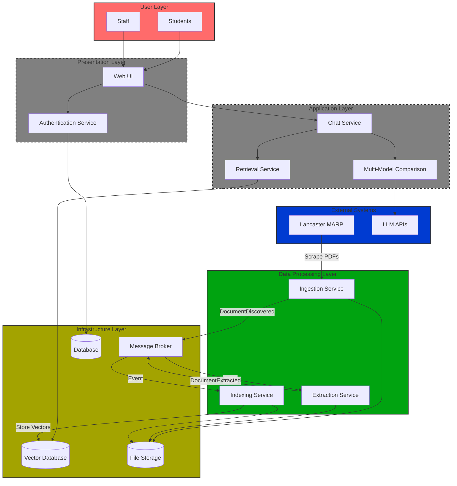

# MARP-Guide-AI

A Retrieval-Augmented Generation (RAG) chatbot that answers questions about Lancaster University's Manual of Academic Regulations and Procedures (MARP).

## Product Overview

**Target Audience**: Students and staff who need quick access to university regulations.

**Value Proposition**: Reliable, quickly accessible information with source.

**Key Features**:

- Answers derived from MARP PDF documents
- Properly cited (title, page number, and link)
- Presented in an understandable manner

## Architecture

This system uses a **microservices architecture** with **event-driven communication** via RabbitMQ.

### High-Level Architecture Overview



**Legend:**

- ✅ **Green** - Operational (Data Processing Pipeline)
- **Yellow** - Infrastructure (Always-on services)
- 🚧 **Gray Dashed** - Planned Features (Tier 1 & 2)
- **Blue** - External Systems
- **Red** - End Users

### Components

1. **Ingestion Service** - Discovers and downloads MARP PDFs from Lancaster's website
2. **Extraction Service** - Extracts text and metadata from PDFs using pdfplumber
3. **Indexing Service** - Chunks documents semantically and generates vector embeddings
4. **Qdrant** - Vector database for semantic search
5. **RabbitMQ** - Message broker for event-driven communication

### Event Flow Pipeline

```
Ingestion → DocumentDiscovered → Extraction → DocumentExtracted → Indexing → ChunksIndexed
```

For detailed architecture diagrams, see:

- [Ingestion Pipeline](docs/diagrams/Ingestion_pipeline.md)
- [Microservices & Broker](docs/diagrams/Microservices_Broker.md)
- [Event Catalogue](docs/events/event-catalogue.md)

## Quick Start

### Prerequisites

- Docker and Docker Compose installed
- At least 4GB of RAM available for containers

### Running the System

1. **Clone the repository**:

   ```bash
   git clone https://github.com/Th30utcast/MARP-Guide-AI.git
   cd MARP-Guide-AI
   ```

2. **Start all services**:

   ```bash
   docker compose up -d
   ```

   This will start:

   - RabbitMQ (message broker)
   - Qdrant (vector database)
   - Ingestion Service (auto-starts PDF discovery and download)
   - Extraction Service (processes PDFs)
   - Indexing Service (generates embeddings and stores in Qdrant)

3. **Monitor logs**:

   ```bash
   # View all services
   docker compose logs -f

   # View specific service
   docker compose logs -f ingestion
   docker compose logs -f extraction
   docker compose logs -f indexing
   ```

4. **Check service health**:
   - Ingestion Service: http://localhost:8001/health
   - RabbitMQ Management UI: http://localhost:15672
   - Qdrant Dashboard: http://localhost:6333/dashboard

### Testing the API

```bash
# Linux/Mac
curl http://localhost:8001/...

# Windows PowerShell
curl.exe http://localhost:8001/...

# Windows CMD
curl http://localhost:8001/...

# Or visit in browser: http://localhost:8001/stats
# Use "ingest" or "stats" or "health" or "extract" instead of the "..."
```

#### Alternative: Use the Browser (Easiest Method - Works on All Platforms)

1. Visit the **FastAPI Interactive Docs**: http://localhost:8001/docs
2. Find the `POST /ingest` endpoint
3. Click "Try it out" → "Execute"
4. View the response directly in the browser

You can also check these URLs directly in your browser:

- Service Info: http://localhost:8001/
- Health Check: http://localhost:8001/health
- Statistics: http://localhost:8001/stats

### Stopping the System

```bash
docker compose down
```

To also remove volumes (PDFs and vector data):

```bash
docker compose down -v
```

## Service Access Details

### RabbitMQ Management UI

- **URL**: http://localhost:15672
- **Username**: `guest`
- **Password**: `guest`

**Key queues to monitor**:

- `documents.discovered` - PDFs ready for extraction
- `documents.extracted` - Text ready for indexing
- `documents.indexed` - Documents indexed in Qdrant

### Qdrant Vector Database

- **HTTP API**: http://localhost:6333
- **Dashboard**: http://localhost:6333/dashboard

**Keys to monitor**:

- View collections (look for `marp-documents`)
- Browse indexed vectors
- Check indexing status
- Test search queries

**Collection details**:

- Name: `marp-documents`
- Vector size: 384 dimensions
- Distance metric: Cosine similarity
- Embedding model: `all-MiniLM-L6-v2`

### Ingestion Service API

- **URL**: http://localhost:8001
- **Endpoints**:
  - `GET /` - Service info
  - `GET /health` - Health check
  - `POST /ingest` - Manually trigger ingestion
  - `GET /stats` - View ingestion statistics

## Data Storage

### PDFs Directory

Downloaded PDFs are stored in:

```
pdfs/
  Intro-to-MARP.pdf
  General-Regs.pdf
  Study-Regs.pdf
  ...
```

### Extracted Data

All events and extracted data are stored in:

```
storage/extracted/{documentId}/
  discovered.json    # DocumentDiscovered event
  pages.jsonl        # Extracted page text (one JSON per line)
  extracted.json     # DocumentExtracted event
  chunks.json        # Document chunks for debugging
  indexed.json       # ChunksIndexed event
```

## Development

### Project Structure

```
MARP-Guide-AI/
├── services/
│   ├── ingestion/          # PDF discovery and download
│   │   ├── main.py         # FastAPI application
│   │   ├── scraper.py      # Web scraping logic
│   │   ├── fetcher.py      # PDF download logic
│   │   └── event_broker.py # RabbitMQ wrapper
│   ├── extraction/         # PDF text extraction
│   │   ├── extraction_service.py
│   │   └── worker.py       # RabbitMQ consumer
│   └── indexing/           # Chunking and embeddings
│       ├── indexing_service.py
│       └── worker.py       # RabbitMQ consumer
├── common/                 # Shared modules
│   ├── events.py           # Event schemas and helpers
│   └── mq.py              # RabbitMQ broker wrapper
├── docs/
│   ├── diagrams/          # Architecture diagrams
│   ├── events/            # Event catalogue
│   └── scrum/             # Product backlog and goals
├── pdfs/                  # Downloaded MARP PDFs
├── storage/extracted/     # Event-sourced data
└── docker-compose.yml     # Service orchestration
```

## Troubleshooting

### Docker won't start

```bash
# View service logs for errors
docker compose logs rabbitmq
docker compose logs qdrant
docker compose logs ingestion
```

### RabbitMQ connection failed

1. Check RabbitMQ is healthy:

   ```bash
   docker compose ps rabbitmq
   ```

2. Verify RabbitMQ is ready:

   ```bash
   docker compose logs rabbitmq | grep "started"
   ```

3. Restart RabbitMQ:
   ```bash
   docker compose restart rabbitmq
   ```

### Qdrant connection failed

1. Check Qdrant is running:

   ```bash
   docker compose ps qdrant
   ```

2. Test Qdrant API:

   ```bash
   # Linux/Mac
   curl http://localhost:6333/collections

   # Windows PowerShell
   curl.exe http://localhost:6333/collections

   # Windows CMD
   curl http://localhost:6333/collections

   # Or visit in browser: http://localhost:6333/collections
   ```

3. Restart Qdrant:
   ```bash
   docker compose restart qdrant
   ```

### No PDFs being downloaded

1. Check ingestion service logs:

   ```bash
   docker compose logs ingestion
   ```

2. Check if PDFs already exist:

   ```bash
   # Linux/Mac
   curl http://localhost:8001/stats

   # Windows PowerShell
   curl.exe http://localhost:8001/stats

   # Windows CMD
   curl http://localhost:8001/stats

   # Or visit in browser: http://localhost:8001/stats
   ```

3. Manually trigger ingestion:

   ```bash
   # Linux/Mac
   curl -X POST http://localhost:8001/ingest

   # Windows PowerShell
   curl.exe -X POST http://localhost:8001/ingest

   # Windows CMD
   curl -X POST http://localhost:8001/ingest

   # Or use browser: http://localhost:8001/docs
   ```

4. Check network connectivity to Lancaster website

### Events not flowing through pipeline

1. Check RabbitMQ queues:

   - Visit http://localhost:15672
   - Login with guest/guest
   - Check "Queues" tab for message counts

2. Verify service health:

   ```bash
   # Linux/Mac
   curl http://localhost:8001/health

   # Windows PowerShell
   curl.exe http://localhost:8001/health

   # Windows CMD
   curl http://localhost:8001/health

   # Or visit in browser: http://localhost:8001/health
   ```

3. Check worker logs for errors:
   ```bash
   docker compose logs extraction
   docker compose logs indexing
   ```

## Technology Stack

### Core Infrastructure

| Technology         | Version         | Purpose                                      |
| ------------------ | --------------- | -------------------------------------------- |
| **Docker**         | Latest          | Containerization platform                    |
| **Docker Compose** | Latest          | Multi-container orchestration                |
| **RabbitMQ**       | 3.12-management | Message broker for event-driven architecture |
| **Qdrant**         | Latest          | Vector database for semantic search          |

### Ingestion Service

| Technology         | Version | Purpose                                  |
| ------------------ | ------- | ---------------------------------------- |
| **FastAPI**        | 0.104.1 | Modern Python web framework for REST API |
| **Uvicorn**        | 0.24.0  | ASGI server for FastAPI                  |
| **BeautifulSoup4** | 4.12.2  | HTML parsing and web scraping            |
| **lxml**           | 5.0.0+  | XML/HTML parser for BeautifulSoup        |
| **Requests**       | 2.31.0  | HTTP client for downloading PDFs         |
| **Pika**           | 1.3.2   | RabbitMQ client for Python               |

### Extraction Service

| Technology     | Version | Purpose                              |
| -------------- | ------- | ------------------------------------ |
| **pdfplumber** | 0.10.3  | PDF text extraction library          |
| **Pika**       | 1.3.2   | RabbitMQ client for consuming events |

### Indexing Service

| Technology                | Version | Purpose                                  |
| ------------------------- | ------- | ---------------------------------------- |
| **sentence-transformers** | 3.0.0+  | Generate semantic embeddings             |
| **qdrant-client**         | 1.7.0   | Python client for Qdrant vector database |
| **NumPy**                 | 1.24.3  | Numerical computations for vectors       |
| **Pika**                  | 1.3.2   | RabbitMQ client for consuming events     |

### Embedding Model

- **Model**: `all-MiniLM-L6-v2` (from sentence-transformers)
- **Vector Dimensions**: 384
- **Distance Metric**: Cosine similarity
- **Use Case**: Lightweight, fast semantic search for document retrieval

### Development Tools

- **Python**: 3.9+
- **Git**: Version control
- **GitHub**: Repository hosting and collaboration
