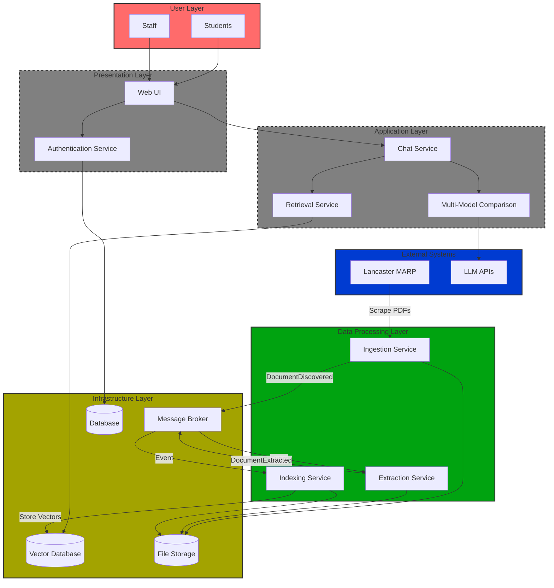

# MARP-Guide-AI


A Retrieval-Augmented Generation (RAG) chatbot that answers questions about Lancaster University's Manual of Academic Regulations and Procedures (MARP).

---

## Table of Contents

- [Product Overview](#product-overview)
- [Architecture](#architecture)
- [Quick Start](#quick-start)
  - [Prerequisites](#prerequisites)
  - [Setup](#setup)
  - [Running the System](#running-the-system)
  - [Testing the Chat Service](#testing-the-chat-service)
- [Service Access Details](#service-access-details)
- [Data Storage](#data-storage)
- [Development](#development)
  - [Project Structure](#project-structure)
  - [Code Quality Tools](#code-quality-tools)
- [Testing](#testing)
  - [Running Tests Locally](#running-tests-locally)
  - [CI/CD Pipeline](#cicd-pipeline)
- [Docker Build Optimization](#docker-build-optimization)
- [Troubleshooting](#troubleshooting)
- [Technology Stack](#technology-stack)

---

## Product Overview

**Target Audience**: Students and staff who need quick access to university regulations.

**Value Proposition**: Reliable, quickly accessible information with proper source citations.

**Key Features**:

- Answers derived from MARP PDF documents
- Properly cited (title, page number, and link)
- Presented in an understandable manner

---

## Architecture

This system uses a **microservices architecture** with **event-driven communication** via RabbitMQ.

### High-Level Architecture Overview



**Legend:**

- ✅ **Green** - Operational (Data Processing Pipeline)
- **Yellow** - Infrastructure (Always-on services)
- 🚧 **Gray Dashed** - Planned Features (Tier 1 & 2)
- **Blue** - External Systems
- **Red** - End Users

### Components

1. **Ingestion Service** - Discovers and downloads MARP PDFs from Lancaster's website
2. **Extraction Service** - Extracts text and metadata from PDFs using pdfplumber
3. **Indexing Service** - Chunks documents semantically and generates vector embeddings
4. **Retrieval Service** - REST API for semantic search over indexed documents
5. **Chat Service** - RAG-powered question answering with LLM integration
6. **Qdrant** - Vector database for semantic search
7. **RabbitMQ** - Message broker for event-driven communication

### Event Flow Pipeline

```
Ingestion → DocumentDiscovered → Extraction → DocumentExtracted → Indexing → ChunksIndexed → Retrieval → Chat
```

For detailed architecture diagrams, see:

- [Ingestion Pipeline](docs/services/Ingestion/Ingestion_pipeline.md)
- [Microservices & Broker](docs/services/Microservices_Broker.md)
- [Event Catalogue](docs/events/event-catalogue.md)

---

## Quick Start

### Prerequisites

- Docker and Docker Compose installed
- At least 4GB of RAM available for containers
- OpenRouter API key (free tier available)

### Setup

1. **Get an OpenRouter API Key**:

   - Visit [openrouter.ai](https://openrouter.ai)
   - Sign up for a free account
   - Get your API key from the dashboard

2. **Configure environment variables**:

   Your `.env` file should look like:

   ```bash
   OPENROUTER_API_KEY=sk-or-v1-xxxxxxxxxxxxx
   ```

   **Note:** If you experience authentication issues, ensure `OPENROUTER_API_KEY` is not exported in your terminal environment (run `unset OPENROUTER_API_KEY` or use a fresh terminal).

### Running the System

1. **Clone the repository**:

   ```bash
   git clone https://github.com/Th30utcast/MARP-Guide-AI.git
   cd MARP-Guide-AI
   ```

2. **Enable Docker BuildKit** (Windows - for faster builds):

   ```powershell
   .\scripts\enable-buildkit.ps1
   ```

3. **Start all services**:

   ```bash
   docker compose up --build
   ```

   This will start:

   - RabbitMQ (message broker)
   - Qdrant (vector database)
   - Ingestion Service (auto-starts PDF discovery and download)
   - Extraction Service (processes PDFs)
   - Indexing Service (generates embeddings and stores in Qdrant)
   - Retrieval Service (REST API for semantic search)
   - Chat Service (RAG-powered question answering)

4. **Monitor logs**:

   ```bash
   # View all services
   docker compose logs -f

   # View specific service
   docker compose logs -f chat
   docker compose logs -f retrieval
   ```

5. **Check service health**:
   - Ingestion Service: <http://localhost:8001/health>
   - Retrieval Service: <http://localhost:8002/health>
   - Chat Service: <http://localhost:8003/health>
   - RabbitMQ Management UI: <http://localhost:15672>
   - Qdrant Dashboard: <http://localhost:6333/dashboard>

### Testing the Chat Service

The **easiest way** to test the chat service is using the provided scripts:

#### Using Chat Scripts (Recommended)

**Mac/Linux:**

```bash
./scripts/chat.sh "What happens if I am ill during exams?"
```

**Windows Command Prompt:**

```cmd
scripts\chat.bat "What happens if I am ill during exams?"
```

**Windows PowerShell:**

```powershell
.\scripts\chat.ps1 -Query "What happens if I am ill during exams?"
```

**Optional parameters:**

```bash
# Specify number of results to retrieve (default: 5)
./scripts/chat.sh "What is MARP?" 3
```

#### Browser Testing (Interactive API)

1. Open your browser and go to: <http://localhost:8003/docs>
2. Click on **POST /chat**
3. Click **"Try it out"**
4. Enter your query:
   ```json
   {
     "query": "What happens if I am ill during exams?",
     "top_k": 5
   }
   ```
5. Click **"Execute"**
6. View the generated answer with citations

#### Command Line Testing (Manual)

**Mac/Linux:**

```bash
curl -X POST http://localhost:8003/chat \
  -H "Content-Type: application/json" \
  -d '{"query": "What is MARP?", "top_k": 5}'
```

**Windows PowerShell:**

```powershell
$body = @{
    query = "What is MARP?"
    top_k = 5
} | ConvertTo-Json

Invoke-RestMethod -Uri http://localhost:8003/chat `
  -Method POST -ContentType "application/json" -Body $body
```

### Stopping the System

```bash
docker compose down
```

To also remove volumes (PDFs and vector data):

```bash
docker compose down -v
```

---

## Service Access Details

### RabbitMQ Management UI

- **URL**: <http://localhost:15672>
- **Username**: `guest`
- **Password**: `guest`
- **Key queues**: `documents.discovered`, `documents.extracted`, `documents.indexed`

### Qdrant Vector Database

- **HTTP API**: <http://localhost:6333>
- **Dashboard**: <http://localhost:6333/dashboard>
- **Collection**: `marp-documents` (384 dimensions, cosine similarity)
- **Embedding Model**: `all-MiniLM-L6-v2`

### Ingestion Service

- **Health Check**: <http://localhost:8001/health>
- **Interactive Docs**: <http://localhost:8001/docs>
- **Statistics**: <http://localhost:8001/stats>

### Retrieval Service API

- **URL**: <http://localhost:8002>
- **Interactive Docs**: <http://localhost:8002/docs>
- **Endpoints**:
  - `GET /health` - Health check
  - `POST /search` - Semantic search endpoint

### Chat Service API

- **URL**: <http://localhost:8003>
- **Interactive Docs**: <http://localhost:8003/docs>
- **Endpoints**:
  - `GET /health` - Health check
  - `POST /chat` - RAG-powered question answering with citations

---

## Data Storage

### PDFs Directory

Downloaded PDFs are stored in:

```
pdfs/
  Intro-to-MARP.pdf
  General-Regs.pdf
  Study-Regs.pdf
  ...
```

### Extracted Data

All events and extracted data are stored in:

```
storage/extracted/{documentId}/
  discovered.json    # DocumentDiscovered event
  pages.jsonl        # Extracted page text (one JSON per line)
  extracted.json     # DocumentExtracted event
  chunks.json        # Document chunks for debugging
  indexed.json       # ChunksIndexed event
```

---

## Development

### Project Structure

```
MARP-Guide-AI/
├── .github/
│   └── workflows/
│       └── ci.yml              # CI/CD pipeline configuration
├── services/
│   ├── ingestion/              # PDF discovery and download
│   │   ├── ingestion_service.py
│   │   └── worker.py
│   ├── extraction/             # PDF text extraction
│   │   ├── extraction_service.py
│   │   └── worker.py
│   ├── indexing/               # Chunking and embeddings
│   │   ├── indexing_service.py
│   │   └── worker.py
│   ├── retrieval/              # Semantic search API
│   │   ├── retrieval_service.py
│   │   ├── retrieval_utils.py
│   │   └── worker.py
│   └── chat/                   # RAG-powered Q&A
│       ├── chat_service.py
│       ├── retrieval_client.py
│       ├── openrouter_client.py
│       └── prompt_templates.py
├── common/                     # Shared modules
│   ├── events.py               # Event schemas
│   ├── mq.py                   # RabbitMQ utilities
│   ├── health.py               # Health checks
│   └── logging_config.py       # Logging setup
├── tests/                      # All test files
│   ├── test_ingestion.py
│   ├── test_extraction.py
│   ├── test_indexing.py
│   ├── test_retrieval.py
│   ├── test_chat.py
│   ├── test_common.py
│   ├── test_integration.py
│   └── README.md               # Testing documentation
├── scripts/                    # Utility scripts
│   ├── chat.sh                 # Chat CLI (Linux/Mac)
│   ├── chat.bat                # Chat CLI (Windows CMD)
│   ├── chat.ps1                # Chat CLI (Windows PowerShell)
│   └── enable-buildkit.ps1     # Enable Docker BuildKit
├── docs/                       # Documentation
│   ├── services/               # Service documentation
│   ├── events/                 # Event catalogue
│   └── scrum/                  # Sprint planning
├── pdfs/                       # Downloaded MARP PDFs
├── storage/                    # Extracted content storage
├── pyproject.toml              # Python tool configuration
├── requirements-test.txt       # Test dependencies
└── docker-compose.yml          # Service orchestration
```

### Code Quality Tools

Configuration is centralized in `pyproject.toml`:

**Format code:**

```bash
black services/ common/ tests/
isort services/ common/ tests/
```

**Lint code:**

```bash
flake8 services/ common/ tests/
```

**Configuration:**

- **black**: Code formatter (line length: 127)
- **isort**: Import sorter (compatible with black)
- **flake8**: Linter for code quality
- **pytest**: Test framework with coverage
- **coverage**: Code coverage tracking

---

## Testing

### Running Tests Locally

**Install test dependencies:**

```bash
pip install -r requirements-test.txt
```

**Run all tests:**

```bash
# Run all tests
pytest

# Run with coverage
pytest --cov=common --cov=services --cov-report=html

# Run specific test file
pytest tests/test_retrieval.py -v

# Run specific test function
pytest tests/test_retrieval.py::test_search_endpoint_success -v
```

**Run tests by marker:**

```bash
# Run only unit tests (fast)
pytest -m unit

# Run only integration tests (requires services)
pytest -m integration
```

**View coverage report:**

```bash
# Generate HTML report
pytest --cov=common --cov=services --cov-report=html

# Open in browser
open htmlcov/index.html  # macOS
start htmlcov/index.html  # Windows
```

See [tests/README.md](tests/README.md) for comprehensive testing documentation including:

- Test structure and organization
- Writing new tests
- Mocking strategies
- CI/CD integration
- Troubleshooting guide

### CI/CD Pipeline

The project uses **GitHub Actions** for automated testing. The CI pipeline runs on every push and pull request.

**Pipeline Stages:**

1. **Lint** (fast, parallel)

   - Code formatting checks (black, isort)
   - Linting with flake8
   - Syntax error detection

2. **Unit Tests** (parallel, depends on lint)

   - All service tests run in parallel
   - Coverage reports generated (HTML, XML, terminal)
   - Artifacts uploaded for download

3. **Integration Tests** (sequential, depends on unit tests)

   - Docker Compose starts RabbitMQ and Qdrant
   - Proper health checks with 60-second timeouts
   - Service logs displayed on failure
   - Cleanup with `docker compose down -v`

4. **Docker Build** (parallel with integration)

   - All service images built and tested
   - Verifies images are functional

5. **Coverage Report** (final summary)
   - Aggregates coverage from all test jobs
   - Displays summary in GitHub Actions

**CI Configuration:** [.github/workflows/ci.yml](.github/workflows/ci.yml)

**Trigger Conditions:**

- Push to `main`, `develop`, `feature/**`, `hotfix/**` branches
- Pull requests to `main` and `develop`

**Viewing Results:**

1. Go to GitHub repository → **Actions** tab
2. Select latest workflow run
3. View job results and logs
4. Download coverage artifacts

**Job Dependencies:**

```
Lint (fast)
  ↓
Unit Tests (parallel) → Integration Tests + Docker Build (parallel)
  ↓
Coverage Report (summary)
```

This follows the **fail-fast** principle: linting errors stop the pipeline immediately, saving time and resources.

---

## Docker Build Optimization

All Dockerfiles have been optimized with **BuildKit cache mounts** for significantly faster builds.

### Enable BuildKit

**Windows (PowerShell):**

```powershell
.\scripts\enable-buildkit.ps1
docker compose up --build
```

**Linux/macOS:**

```bash
export DOCKER_BUILDKIT=1
export COMPOSE_DOCKER_CLI_BUILD=1
docker compose up --build
```

**Make it permanent (Windows):**

1. Press `Win + X` → System → Advanced system settings
2. Environment Variables → New (User variables)
3. Add: `DOCKER_BUILDKIT` = `1`
4. Add: `COMPOSE_DOCKER_CLI_BUILD` = `1`

### Performance Improvements

| Build Type            | Before    | After       | Improvement              |
| --------------------- | --------- | ----------- | ------------------------ |
| First build           | 10-15 min | 10-15 min   | Same (needs to download) |
| Rebuild (code change) | 10-15 min | **3-5 min** | **3-5x faster**          |
| Rebuild (no changes)  | 8-10 min  | **30 sec**  | **16-20x faster**        |

### How It Works

All Dockerfiles now use:

```dockerfile
RUN --mount=type=cache,target=/root/.cache/pip \
    pip install -r requirements.txt
```

This caches pip downloads between builds without increasing the final image size.

---

## Troubleshooting

### Docker won't start

```bash
docker compose logs rabbitmq
docker compose logs qdrant
docker compose logs ingestion
```

### RabbitMQ connection failed

1. Check status: `docker compose ps rabbitmq`
2. View logs: `docker compose logs rabbitmq | grep "started"`
3. Restart: `docker compose restart rabbitmq`

### Qdrant connection failed

1. Check status: `docker compose ps qdrant`
2. Test API: `curl http://localhost:6333/collections`
3. Restart: `docker compose restart qdrant`

### No PDFs being downloaded

1. Check logs: `docker compose logs ingestion`
2. Check stats: Visit <http://localhost:8001/stats>
3. Manually trigger: Visit <http://localhost:8001/docs> → `POST /ingest`

### Events not flowing through pipeline

1. Check RabbitMQ queues: <http://localhost:15672> (guest/guest)
2. Verify service health: <http://localhost:8001/health>
3. Check worker logs: `docker compose logs extraction indexing`

### Tests failing locally

1. Ensure dependencies installed: `pip install -r requirements-test.txt`
2. Run from project root: `cd MARP-Guide-AI && pytest`
3. For integration tests: `docker compose up -d rabbitmq qdrant`

---

## Technology Stack

### Core Infrastructure

| Technology     | Version         | Purpose                       |
| -------------- | --------------- | ----------------------------- |
| Docker         | Latest          | Containerization platform     |
| Docker Compose | Latest          | Multi-container orchestration |
| RabbitMQ       | 3.12-management | Message broker                |
| Qdrant         | Latest          | Vector database               |

### Python Services

| Technology | Version | Purpose                     |
| ---------- | ------- | --------------------------- |
| Python     | 3.11    | Programming language        |
| FastAPI    | 0.104.1 | Web framework for REST APIs |
| Uvicorn    | 0.24.0  | ASGI server                 |
| Pydantic   | 2.0+    | Data validation             |
| Pika       | 1.3.2   | RabbitMQ client             |

### Data Processing

| Technology            | Version | Purpose              |
| --------------------- | ------- | -------------------- |
| sentence-transformers | 3.0.0+  | Generate embeddings  |
| qdrant-client         | 1.7.0   | Qdrant Python client |
| pdfplumber            | 0.10.3  | PDF text extraction  |
| BeautifulSoup4        | 4.12.2  | HTML parsing         |
| httpx                 | Latest  | Async HTTP client    |

### AI/ML Models

- **Embedding Model**: `all-MiniLM-L6-v2` (384 dimensions, cosine similarity)
- **LLM Provider**: OpenRouter
- **LLM Model**: `google/gemma-3n-e2b-it:free` (Temperature: 0.7, Max Tokens: 500)

### Development Tools

- **pytest**: Testing framework with coverage
- **black**: Code formatter (line length: 127)
- **isort**: Import sorter
- **flake8**: Linter for code quality
- **GitHub Actions**: CI/CD pipeline

---

## Contributors

- Development Team: [Contributors](https://github.com/Th30utcast/MARP-Guide-AI/graphs/contributors)

---

## License

This project is developed as part of Lancaster University's coursework.

---

**Questions or Issues?** Open an issue on [GitHub](https://github.com/Th30utcast/MARP-Guide-AI/issues)
