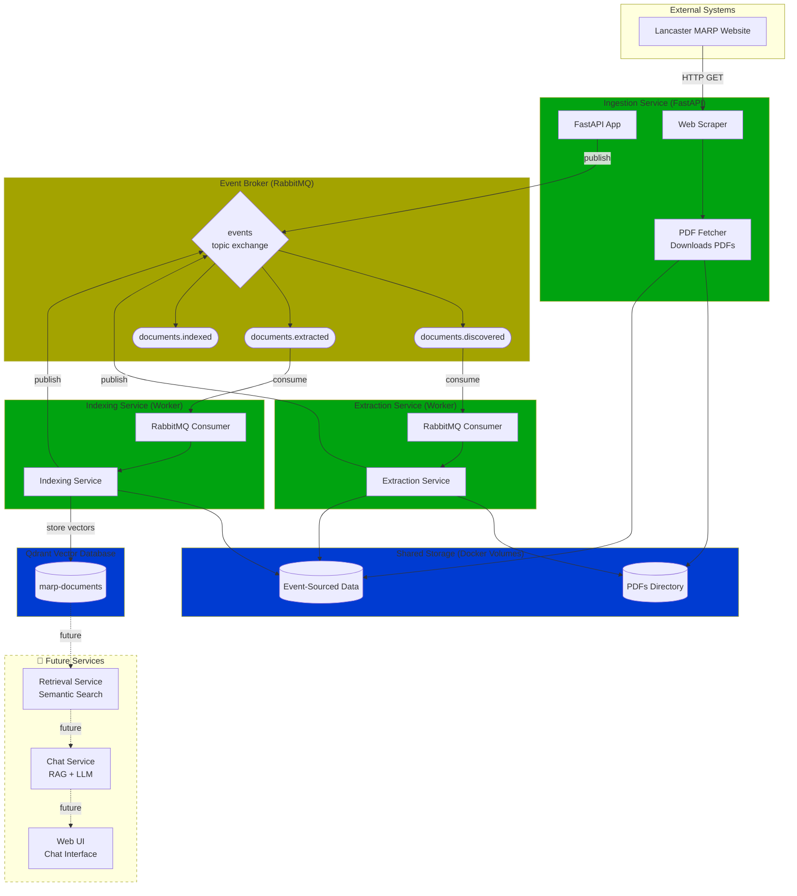

# Microservices Architecture with Event Broker



## Legend

- **Green**: Implemented and operational services
- **Yellow**: Message broker infrastructure
- **Blue**: Data storage systems
- **Gray (dashed)**: Planned future components

## Current Status

- ✅ **Operational**: Ingestion → Extraction → Indexing pipeline
- 🚧 **In Development**: Retrieval, Chat, and Web UI services

## Event Details

### 1. DocumentDiscovered

```json
{
  "eventType": "DocumentDiscovered",
  "eventId": "uuid",
  "timestamp": "2025-11-02T14:53:38Z",
  "correlationId": "uuid",
  "source": "ingestion-service",
  "version": "1.0",
  "payload": {
    "documentId": "Intro-to-MARP",
    "title": "Introduction to MARP",
    "url": "/app/pdfs/Intro-to-MARP.pdf",
    "originalUrl": "https://www.lancaster.ac.uk/.../Intro-to-MARP.pdf",
    "discoveredAt": "2025-11-02T14:53:38Z",
    "fileSize": 224431
  }
}
```

### 2. DocumentExtracted

```json
{
  "eventType": "DocumentExtracted",
  "payload": {
    "documentId": "Intro-to-MARP",
    "textExtracted": true,
    "pageCount": 10,
    "metadata": {
      "title": "MANUAL OF ACADEMIC REGULATIONS AND PROCEDURES (MARP)",
      "author": "Duff, Claire",
      "year": 2025,
      "creator": "Acrobat PDFMaker 25 for Word",
      "producer": "Adobe PDF Library 25.1.213"
    },
    "extractedAt": "2025-11-02T14:53:39Z",
    "extractionMethod": "pdfplumber"
  }
}
```

### 3. ChunksIndexed

```json
{
  "eventType": "ChunksIndexed",
  "payload": {
    "documentId": "Intro-to-MARP",
    "chunkCount": 10,
    "embeddingModel": "all-MiniLM-L6-v2",
    "vectorDim": 384,
    "indexName": "marp-documents",
    "indexedAt": "2025-11-02T14:53:57Z"
  }
}
```

## Storage Structure

```
pdfs/
  Intro-to-MARP.pdf
  General-Regs.pdf
  ...

storage/extracted/
  Intro-to-MARP/
    discovered.json    ← DocumentDiscovered event
    pages.jsonl        ← Extracted text (one page per line)
    extracted.json     ← DocumentExtracted event
    chunks.json        ← All chunks with metadata
    indexed.json       ← ChunksIndexed event
```
