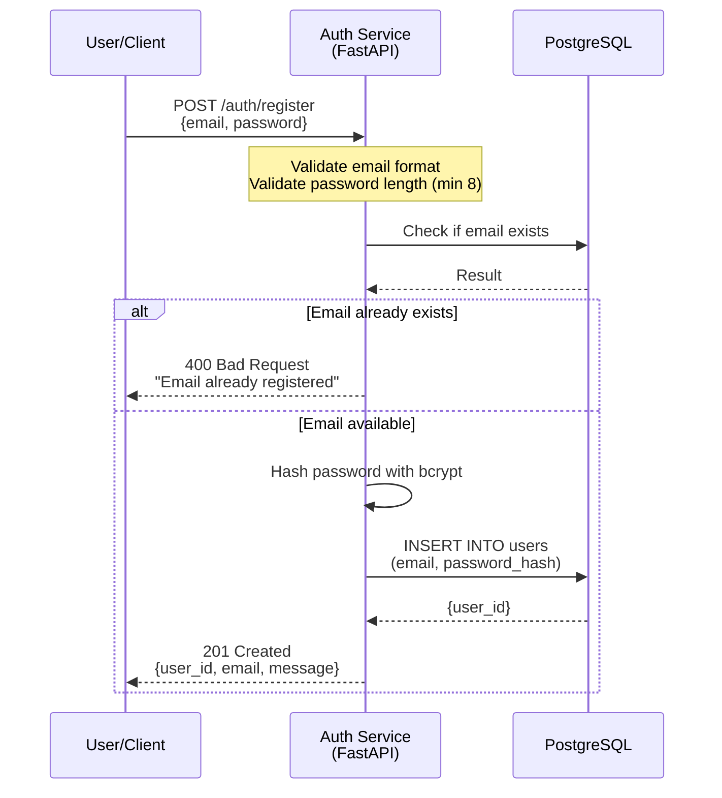
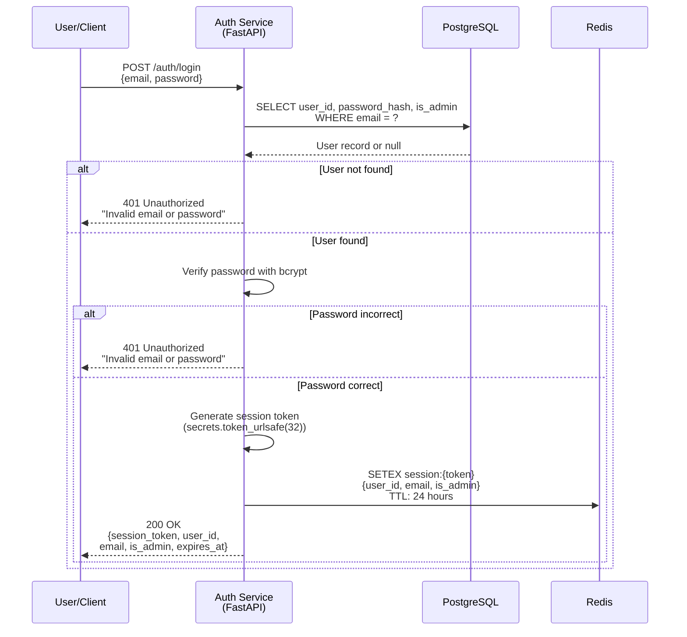
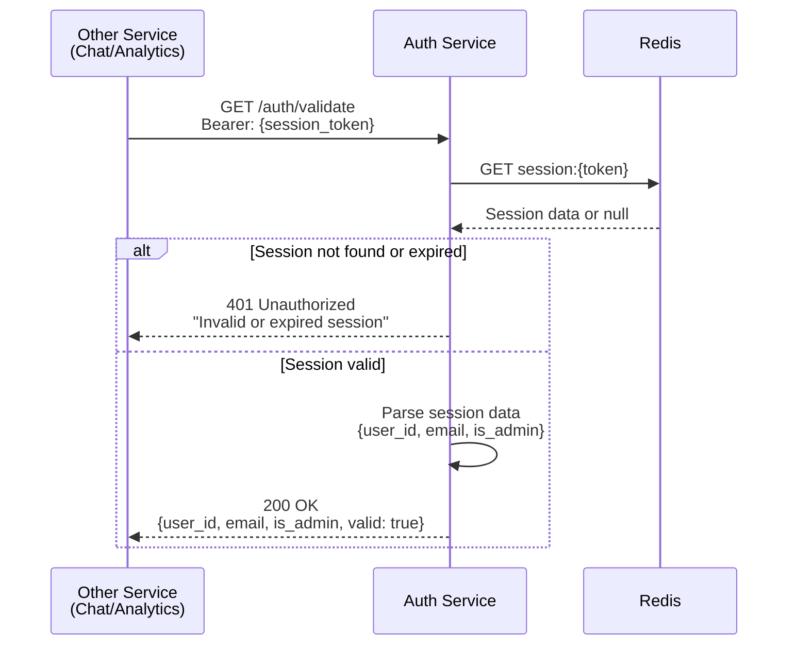
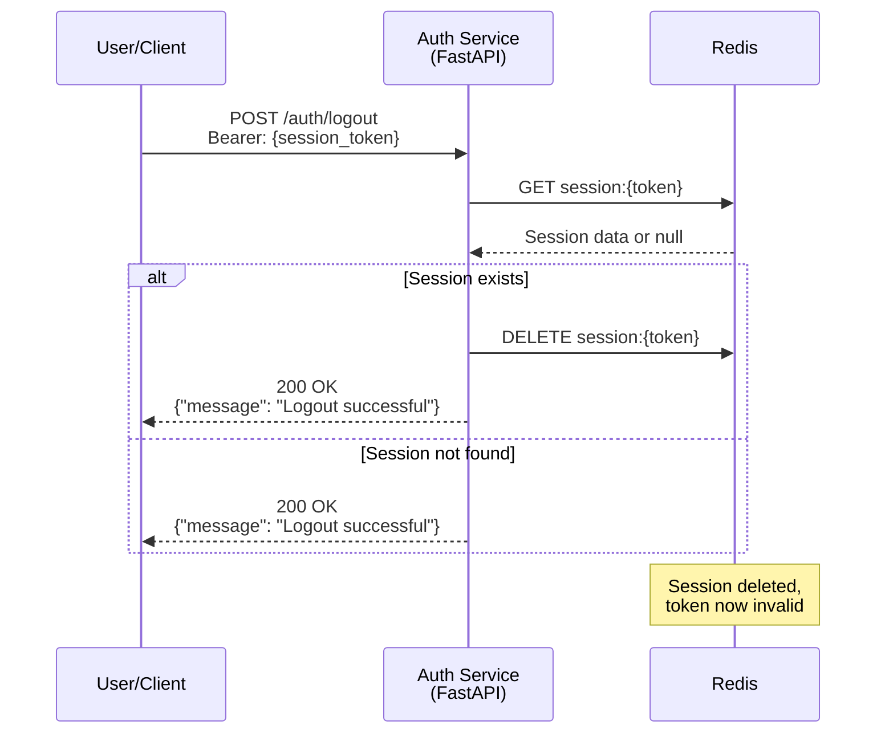
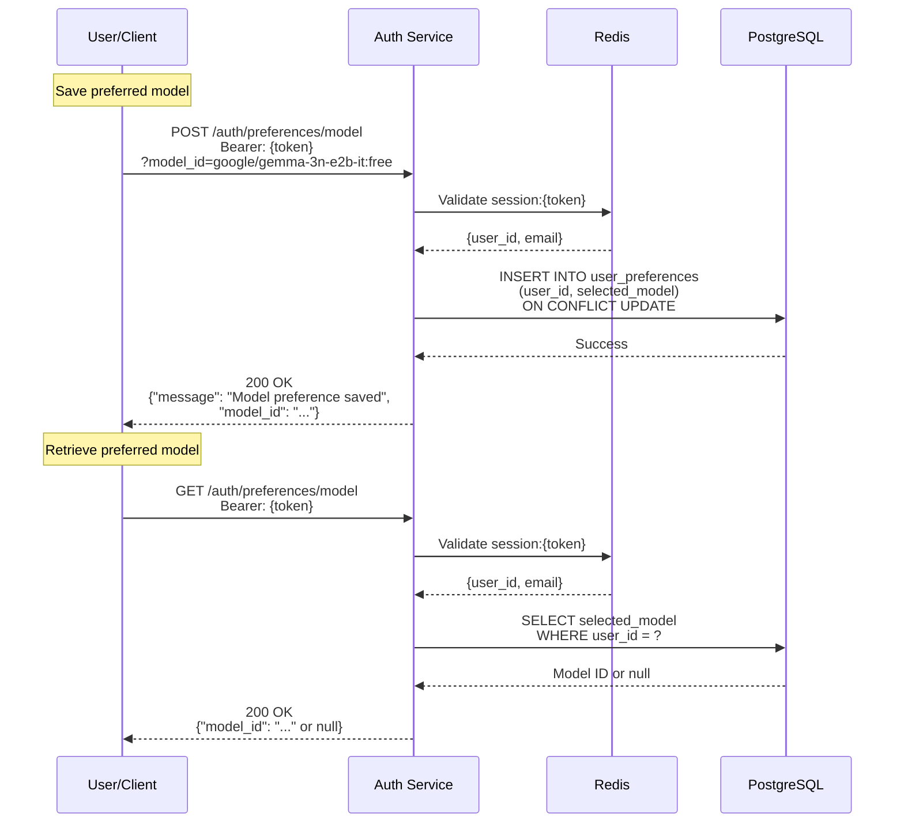

# Authentication Service Pipeline

Overview of user registration, login, session management, and validation flows.

## Registration Flow



## Login Flow



## Session Validation Flow



## Logout Flow



## Model Preference Flow



## Registration Request

```json
{
  "email": "student@example.com",
  "password": "securepassword123"
}
```

## Registration Response

```json
{
  "user_id": "550e8400-e29b-41d4-a716-446655440000",
  "email": "student@example.com",
  "message": "Registration successful"
}
```

## Login Request

```json
{
  "email": "student@example.com",
  "password": "securepassword123"
}
```

## Login Response

```json
{
  "session_token": "xY9Kp2mN5vT8wQ3rL6zA1bC4eD7fG0hJ",
  "user_id": "550e8400-e29b-41d4-a716-446655440000",
  "email": "student@example.com",
  "is_admin": false,
  "expires_at": "2025-12-11T10:30:00Z"
}
```

## Validation Response

```json
{
  "user_id": "550e8400-e29b-41d4-a716-446655440000",
  "email": "student@example.com",
  "is_admin": false,
  "valid": true
}
```

## Security Features

### Password Hashing
- Algorithm: bcrypt
- Salt: Automatically generated per password
- Password never stored in plaintext
- Password never logged

### Session Tokens
- Generation: `secrets.token_urlsafe(32)` (cryptographically secure)
- Length: 43 characters (base64url-encoded)
- Storage: Redis with automatic expiration
- TTL: 24 hours (86400 seconds)

### Session Data Structure

**Redis Key:** `session:{token}`

**Redis Value (JSON):**
```json
{
  "user_id": "550e8400-e29b-41d4-a716-446655440000",
  "email": "student@example.com",
  "is_admin": false
}
```

**TTL:** 86400 seconds (24 hours)

## Database Schema

### Users Table

```sql
CREATE TABLE users (
    user_id UUID PRIMARY KEY DEFAULT gen_random_uuid(),
    email VARCHAR(255) UNIQUE NOT NULL,
    password_hash VARCHAR(255) NOT NULL,
    is_admin BOOLEAN DEFAULT FALSE,
    created_at TIMESTAMP DEFAULT CURRENT_TIMESTAMP
);
```

### User Preferences Table

```sql
CREATE TABLE user_preferences (
    user_id UUID PRIMARY KEY REFERENCES users(user_id) ON DELETE CASCADE,
    selected_model VARCHAR(255),
    updated_at TIMESTAMP DEFAULT CURRENT_TIMESTAMP
);
```

## Admin User

**Default Admin Account:**
- Email: `admin@example.com`
- Password: `admin`
- Created automatically on service startup
- `is_admin` flag set to `true`

**Admin Capabilities:**
- View global analytics (all users)
- Regular users can only view their own analytics

## Validation Patterns

### Email Validation
- Pydantic `EmailStr` type validation
- Must contain `@` symbol
- Must have domain extension after `@`

### Password Validation
- Minimum length: 8 characters
- Enforced via Pydantic `Field(min_length=8)`
- Additional whitespace check

### Session Token Validation
- Must be present in Authorization header
- Format: `Bearer <token>`
- Must exist in Redis
- Must not be expired

## Error Responses

### 400 Bad Request
- Invalid email format
- Password too short
- Email already registered
- Missing user_id parameter (non-admin users)

### 401 Unauthorized
- Invalid email or password
- Missing authorization header
- Invalid or expired session
- Invalid session format

### 500 Internal Server Error
- Database connection failure
- Redis connection failure
- Unexpected errors

## Technologies

- **Framework**: FastAPI + Pydantic
- **Password Hashing**: bcrypt
- **Session Storage**: Redis (with TTL)
- **User Storage**: PostgreSQL
- **Token Generation**: Python secrets module
- **Validation**: Pydantic models
