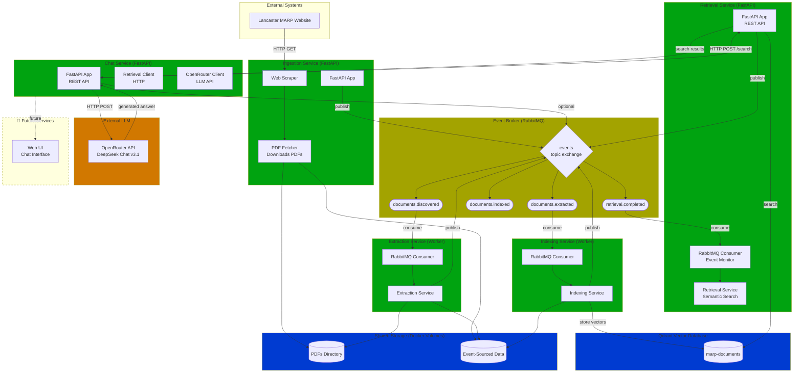

# Microservices Architecture with Event Broker



## Legend

- **Green**: Implemented and operational services
- **Yellow**: Message broker infrastructure
- **Blue**: Data storage systems
- **Orange**: External LLM services
- **Gray (dashed)**: Planned future components

## Current Status

- ✅ **Operational**: Ingestion → Extraction → Indexing → Retrieval → Chat pipeline
- 🚧 **In Development**: Web UI service

## Event Details

### 1. DocumentDiscovered

```json
{
  "eventType": "DocumentDiscovered",
  "eventId": "uuid",
  "timestamp": "2025-11-02T14:53:38Z",
  "correlationId": "uuid",
  "source": "ingestion-service",
  "version": "1.0",
  "payload": {
    "documentId": "Intro-to-MARP",
    "title": "Introduction to MARP",
    "url": "/app/pdfs/Intro-to-MARP.pdf",
    "originalUrl": "https://www.lancaster.ac.uk/.../Intro-to-MARP.pdf",
    "discoveredAt": "2025-11-02T14:53:38Z",
    "fileSize": 224431
  }
}
```

### 2. DocumentExtracted

```json
{
  "eventType": "DocumentExtracted",
  "payload": {
    "documentId": "Intro-to-MARP",
    "textExtracted": true,
    "pageCount": 10,
    "metadata": {
      "title": "MANUAL OF ACADEMIC REGULATIONS AND PROCEDURES (MARP)",
      "author": "Duff, Claire",
      "year": 2025,
      "creator": "Acrobat PDFMaker 25 for Word",
      "producer": "Adobe PDF Library 25.1.213"
    },
    "extractedAt": "2025-11-02T14:53:39Z",
    "extractionMethod": "pdfplumber"
  }
}
```

### 3. ChunksIndexed

```json
{
  "eventType": "ChunksIndexed",
  "payload": {
    "documentId": "Intro-to-MARP",
    "chunkCount": 10,
    "embeddingModel": "all-MiniLM-L6-v2",
    "vectorDim": 384,
    "indexName": "marp-documents",
    "indexedAt": "2025-11-02T14:53:57Z"
  }
}
```

### 4. RetrievalCompleted

```json
{
  "eventType": "RetrievalCompleted",
  "eventId": "uuid",
  "timestamp": "2025-11-04T18:30:45Z",
  "correlationId": "uuid",
  "source": "retrieval-service",
  "version": "1.0",
  "payload": {
    "query": "What happens if I am ill during exams?",
    "topK": 5,
    "resultCount": 5,
    "latencyMs": 42.5,
    "retrievedAt": "2025-11-04T18:30:45Z",
    "resultsSummary": [
      {
        "documentId": "Intro-to-MARP",
        "chunkIndex": 3,
        "score": 0.87
      }
    ]
  }
}
```

### 5. AnswerGenerated

```json
{
  "eventType": "AnswerGenerated",
  "eventId": "uuid",
  "timestamp": "2025-11-04T18:30:47Z",
  "correlationId": "uuid",
  "source": "chat-service",
  "version": "1.0",
  "payload": {
    "query": "What happens if I am ill during exams?",
    "answer": "According to the MARP regulations, if you are ill during exams you should submit an Extenuating Circumstances claim...",
    "citation_count": 2,
    "generated_at": "2025-11-04T18:30:47Z",
    "trace_id": "trace-abc123"
  }
}
```

## Storage Structure

```
pdfs/
  Intro-to-MARP.pdf
  General-Regs.pdf
  ...

storage/extracted/
  Intro-to-MARP/
    discovered.json    ← DocumentDiscovered event
    pages.jsonl        ← Extracted text (one page per line)
    extracted.json     ← DocumentExtracted event
    chunks.json        ← All chunks with metadata
    indexed.json       ← ChunksIndexed event
```

## Service Architecture

### Common Modules

All services utilize shared modules for consistency:

- **`common/events.py`** - Event schemas and helper functions for creating events
- **`common/mq.py`** - RabbitMQ broker wrapper with typed callbacks
- **`common/health.py`** - Reusable health check functionality
- **`common/logging_config.py`** - Standardized logging configuration

### Service Endpoints

#### Ingestion Service (Port 8001)

- `GET /health` - Health check
- `POST /ingest` - Manually trigger ingestion
- `GET /stats` - View ingestion statistics

#### Retrieval Service (Port 8002)

- `GET /health` - Health check (returns model info and collection status)
- `GET /readyz` - Readiness check (verifies Qdrant connectivity)
- `POST /search` - Semantic search endpoint
  - Request: `{"query": "your question", "top_k": 5}`
  - Response: Returns top-k results with text, metadata, and relevance scores
- `GET /docs` - Interactive API documentation (Swagger UI)

#### Chat Service (Port 8003)

- `GET /health` - Health check
- `POST /chat` - RAG-powered question answering
  - Request: `{"query": "your question", "top_k": 5}`
  - Response: Returns generated answer with citations
- `GET /docs` - Interactive API documentation (Swagger UI)

### Docker Compose Configuration

Services are orchestrated with proper health checks and restart policies:

- **RabbitMQ** - Always running message broker
- **Qdrant** - Always running vector database
- **Ingestion** - Runs once at startup, exits when complete
- **Extraction** - Worker that processes documents continuously
- **Indexing** - Worker that indexes documents continuously
- **Retrieval** - Always running REST API service
- **Chat** - Always running REST API service (RAG pipeline)
