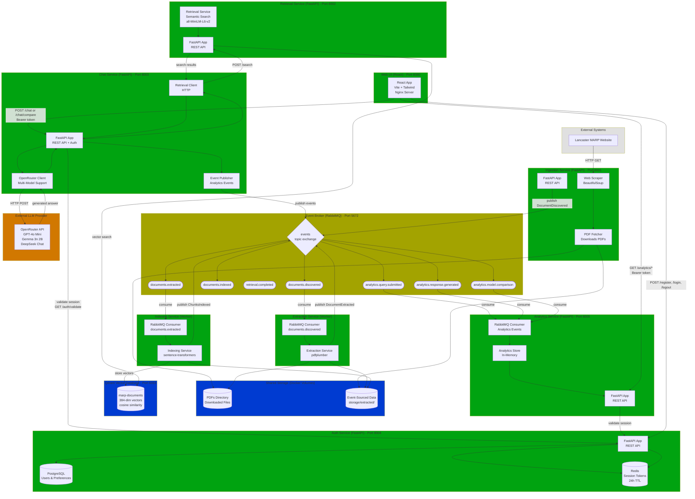

# Microservices Architecture with Event Broker



## Legend

- **Green**: Implemented and operational services
- **Yellow**: Message broker infrastructure
- **Blue**: Data storage systems
- **Orange**: External LLM services
- **Gray (dashed)**: Planned future components

## Current Status

- ✅ **Operational**: All services fully implemented and operational
  - Data Pipeline: Ingestion → Extraction → Indexing
  - Query Pipeline: Retrieval → Chat (RAG + Multi-Model Comparison)
  - User Services: Auth → Web UI
  - Analytics: Event tracking and usage insights

## Event Details

### 1. DocumentDiscovered

```json
{
  "eventType": "DocumentDiscovered",
  "eventId": "uuid",
  "timestamp": "2025-11-02T14:53:38Z",
  "correlationId": "uuid",
  "source": "ingestion-service",
  "version": "1.0",
  "payload": {
    "documentId": "Intro-to-MARP",
    "title": "Introduction to MARP",
    "url": "/app/pdfs/Intro-to-MARP.pdf",
    "originalUrl": "https://www.lancaster.ac.uk/.../Intro-to-MARP.pdf",
    "discoveredAt": "2025-11-02T14:53:38Z",
    "fileSize": 224431
  }
}
```

### 2. DocumentExtracted

```json
{
  "eventType": "DocumentExtracted",
  "payload": {
    "documentId": "Intro-to-MARP",
    "textExtracted": true,
    "pageCount": 10,
    "metadata": {
      "title": "MANUAL OF ACADEMIC REGULATIONS AND PROCEDURES (MARP)",
      "author": "Duff, Claire",
      "year": 2025,
      "creator": "Acrobat PDFMaker 25 for Word",
      "producer": "Adobe PDF Library 25.1.213"
    },
    "extractedAt": "2025-11-02T14:53:39Z",
    "extractionMethod": "pdfplumber"
  }
}
```

### 3. ChunksIndexed

```json
{
  "eventType": "ChunksIndexed",
  "payload": {
    "documentId": "Intro-to-MARP",
    "chunkCount": 10,
    "embeddingModel": "all-MiniLM-L6-v2",
    "vectorDim": 384,
    "indexName": "marp-documents",
    "indexedAt": "2025-11-02T14:53:57Z"
  }
}
```

### 4. RetrievalCompleted

```json
{
  "eventType": "RetrievalCompleted",
  "eventId": "uuid",
  "timestamp": "2025-11-04T18:30:45Z",
  "correlationId": "uuid",
  "source": "retrieval-service",
  "version": "1.0",
  "payload": {
    "query": "What happens if I am ill during exams?",
    "topK": 5,
    "resultCount": 5,
    "latencyMs": 42.5,
    "retrievedAt": "2025-11-04T18:30:45Z",
    "resultsSummary": [
      {
        "documentId": "Intro-to-MARP",
        "chunkIndex": 3,
        "score": 0.87
      }
    ]
  }
}
```

### 5. QuerySubmitted

```json
{
  "eventType": "QuerySubmitted",
  "eventId": "uuid",
  "timestamp": "2025-11-04T18:30:45Z",
  "correlationId": "uuid",
  "source": "chat-service",
  "version": "1.0",
  "payload": {
    "query": "What happens if I am ill during exams?",
    "userSessionId": "session-abc-123",
    "modelId": "openai/gpt-4o-mini",
    "userId": "user-12345"
  }
}
```

### 6. ResponseGenerated

```json
{
  "eventType": "ResponseGenerated",
  "eventId": "uuid",
  "timestamp": "2025-11-04T18:30:47Z",
  "correlationId": "uuid",
  "source": "chat-service",
  "version": "1.0",
  "payload": {
    "query": "What happens if I am ill during exams?",
    "response": "According to the MARP regulations, if you are ill during exams you should submit an Extenuating Circumstances claim...",
    "modelId": "openai/gpt-4o-mini",
    "userSessionId": "session-abc-123",
    "latencyMs": 1247.3,
    "citationCount": 3,
    "retrievalCount": 5,
    "userId": "user-12345"
  }
}
```

### 7. ModelComparisonTriggered

```json
{
  "eventType": "ModelComparisonTriggered",
  "eventId": "uuid",
  "timestamp": "2025-11-04T18:35:00Z",
  "correlationId": "uuid",
  "source": "chat-service",
  "version": "1.0",
  "payload": {
    "query": "What is the grade appeal process?",
    "userSessionId": "session-abc-123",
    "models": [
      "openai/gpt-4o-mini",
      "google/gemma-3n-e2b-it:free",
      "deepseek/deepseek-chat"
    ],
    "userId": "user-12345"
  }
}
```

### Failure Events

All services publish failure events when errors occur:

- **IngestionFailed** → `documents.ingestion.failed`
- **ExtractionFailed** → `documents.extraction.failed`
- **IndexingFailed** → `documents.indexing.failed`

## Storage Structure

```
pdfs/
  Intro-to-MARP.pdf
  General-Regs.pdf
  ...

storage/extracted/
  Intro-to-MARP/
    discovered.json    ← DocumentDiscovered event
    pages.jsonl        ← Extracted text (one page per line)
    extracted.json     ← DocumentExtracted event
    chunks.json        ← All chunks with metadata
    indexed.json       ← ChunksIndexed event
```

## Service Architecture

### Common Modules

All services utilize shared modules for consistency:

- **`common/events.py`** - Event schemas and helper functions for creating events
- **`common/mq.py`** - RabbitMQ broker wrapper with typed callbacks
- **`common/health.py`** - Reusable health check functionality
- **`common/logging_config.py`** - Standardized logging configuration

### Service Endpoints

#### Ingestion Service (Port 8001)

- `GET /health` - Health check
- `GET /stats` - View ingestion statistics
- `GET /docs` - Interactive API documentation

#### Retrieval Service (Port 8002)

- `GET /health` - Health check (includes Qdrant connectivity)
- `POST /search` - Semantic search endpoint
  - Request: `{"query": "your question", "top_k": 5}`
  - Response: Returns top-k results with text, metadata, and scores (max 1700 chars per result)
- `GET /docs` - Interactive API documentation

#### Chat Service (Port 8003)

**Requires Authentication**: All endpoints need `Authorization: Bearer <token>` header

- `GET /health` - Health check
- `POST /chat` - Single model RAG-powered question answering
  - Request: `{"query": "your question", "top_k": 8, "model_id": "openai/gpt-4o-mini"}`
  - Response: Returns generated answer with citations
- `POST /chat/compare` - Multi-model comparison (3 models in parallel)
  - Request: `{"query": "your question", "top_k": 8}`
  - Response: Returns 3 answers from different models
- `POST /chat/comparison/select` - Record user's model selection
- `GET /docs` - Interactive API documentation

#### Auth Service (Port 8004)

- `GET /health` - Health check
- `POST /register` - Create new user account
  - Request: `{"email": "user@example.com", "password": "password"}`
- `POST /login` - Login and get session token (24h expiry)
  - Request: `{"email": "user@example.com", "password": "password"}`
  - Response: `{"token": "session-token"}`
- `POST /validate-session` - Validate Bearer token
- `POST /password-reset` - Reset user password
- `GET /auth/preferences/model` - Get user's preferred model
- `POST /auth/preferences/model` - Set user's preferred model
- `GET /docs` - Interactive API documentation

#### Analytics Service (Port 8005)

- `GET /health` - Health check
- `GET /analytics/summary` - Overall usage statistics
- `GET /analytics/queries/popular` - Most common queries
- `GET /analytics/models/stats` - Per-model performance metrics
- `GET /analytics/users/{user_id}/history` - User query history
- `POST /analytics/reset` - Reset analytics data (admin only)
- `GET /docs` - Interactive API documentation

#### Web UI (Port 8080)

- React single-page application
- Features:
  - User registration and login
  - RAG-powered chat with citations
  - Automatic multi-model comparison (on 2nd query)
  - Analytics dashboard
  - Lancaster University branding

### Docker Compose Configuration

Services are orchestrated with proper health checks and restart policies:

**Infrastructure:**
- **RabbitMQ** (Port 5672, Management UI: 15672) - Message broker
- **Qdrant** (Port 6333) - Vector database
- **PostgreSQL** (Port 5432) - User database
- **Redis** (Port 6379) - Session storage

**Data Processing Pipeline:**
- **Ingestion** (Port 8001) - Runs once at startup, auto-discovers PDFs
- **Extraction** - Worker that processes documents continuously
- **Indexing** - Worker that indexes documents continuously

**Application Services:**
- **Retrieval** (Port 8002) - REST API for semantic search
- **Chat** (Port 8003) - RAG + Multi-Model Comparison API
- **Auth** (Port 8004) - User authentication and session management
- **Analytics** (Port 8005) - Usage tracking and insights

**Frontend:**
- **Web UI** (Port 8080) - React app for user interaction
