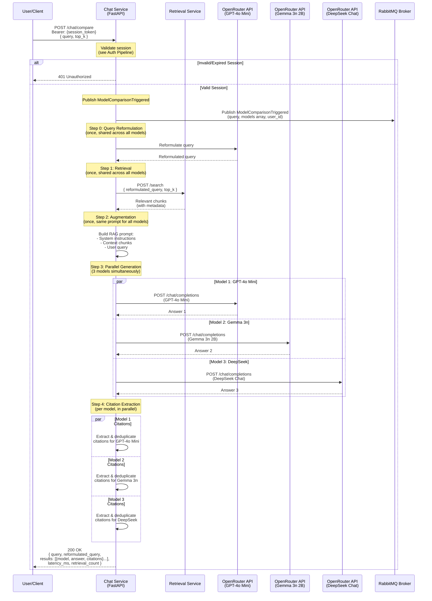

# Multi-Model Comparison Pipeline

Overview of the parallel multi-model answer generation process.

**Note:** For authentication flows, see [Auth Pipeline](../Auth/Auth_pipeline.md)



## Comparison Request

```json
{
  "query": "What is the grade appeal process?",
  "top_k": 8,
  "session_id": "optional-session-id"
}
```

**Headers:**
```
Authorization: Bearer <session_token>
```

## Comparison Response

```json
{
  "query": "What is the grade appeal process?",
  "reformulated_query": "What is the process for appealing academic grades?",
  "results": [
    {
      "model_id": "openai/gpt-4o-mini",
      "model_name": "GPT-4o Mini",
      "answer": "The grade appeal process involves...",
      "citations": [
        {
          "title": "Assessment Regulations",
          "page": 12,
          "url": "https://lancaster.ac.uk/.../Assessment-Regs.pdf"
        }
      ]
    },
    {
      "model_id": "google/gemma-3n-e2b-it:free",
      "model_name": "Google Gemma 3n 2B",
      "answer": "To appeal a grade, you must...",
      "citations": [...]
    },
    {
      "model_id": "deepseek/deepseek-chat",
      "model_name": "DeepSeek Chat",
      "answer": "According to MARP regulations...",
      "citations": [...]
    }
  ],
  "latency_ms": 3247.5,
  "retrieval_count": 8
}
```

## Model Selection Request

After comparing results, users can select their preferred model:

```json
{
  "query": "What is the grade appeal process?",
  "model_id": "google/gemma-3n-e2b-it:free",
  "answer": "To appeal a grade, you must...",
  "citation_count": 3,
  "retrieval_count": 8,
  "latency_ms": 2847.5,
  "session_id": "optional-session-id"
}
```

**Endpoint:** `POST /chat/comparison/select`

## Pipeline Steps

### Step 0: Query Reformulation (Shared)
- **Executed**: Once before retrieval
- **Purpose**: Fix typos, improve clarity
- **Used By**: All 3 models receive same reformulated query
- **Ensures**: Fair comparison (identical input)

### Step 1: Retrieval (Shared)
- **Executed**: Once before generation
- **Service**: Retrieval Service via HTTP
- **Used By**: All 3 models receive same document chunks
- **Ensures**: Fair comparison (identical context)

### Step 2: Augmentation (Shared)
- **Executed**: Once before generation
- **Process**: Build RAG prompt from chunks
- **Used By**: All 3 models receive same prompt template
- **Ensures**: Fair comparison (identical instructions)

### Step 3: Parallel Generation
- **Method**: ThreadPoolExecutor with 3 workers
- **Execution**: All 3 models called simultaneously
- **Latency**: Total time = max(model1, model2, model3) + retrieval
- **Error Handling**: Failed models don't block successful ones

**Models:**
1. **GPT-4o Mini** (`openai/gpt-4o-mini`)
   - Fast and efficient for general questions

2. **Google Gemma 3n 2B** (`google/gemma-3n-e2b-it:free`)
   - Lightweight and fast Google model

3. **DeepSeek Chat** (`deepseek/deepseek-chat`)
   - Dialogue-optimized for conversational QA

### Step 4: Citation Extraction (Per Model)
Each model independently:
1. Extracts citation numbers from answer
2. Validates against retrieved chunks
3. Performs anti-hallucination check (rejects if no citations)
4. Deduplicates by (title, page) tuple
5. Renumbers citations consecutively
6. Returns final answer with clean citations

## Parallel Execution Details

### ThreadPoolExecutor Implementation

```python
with ThreadPoolExecutor(max_workers=3) as executor:
    future_to_model = {
        executor.submit(generate_with_model, model): model
        for model in COMPARISON_MODELS
    }

    for future in as_completed(future_to_model):
        result = future.result()
        results.append(result)
```

**Benefits:**
- Reduced latency (parallel vs sequential)
- Independent error handling per model
- Results collected as they complete
- Timeout handling per model

### Performance Characteristics

**Typical Latency Breakdown:**
- Query reformulation: ~500-1000ms (shared, once)
- Retrieval: ~500-1000ms (shared, once)
- Model execution: ~2000-4000ms (parallel, max of 3)
- Citation processing: ~100-200ms per model (parallel)
- **Total**: ~3000-5000ms

**Sequential Would Be:**
- ~8000-15000ms (sum of all operations)

**Speedup:** 2.5-3x faster with parallel execution

## Analytics Events

### ModelComparisonTriggered
- **When**: Published when `/chat/compare` is called
- **Payload**: query, user_session_id, models array, user_id
- **Routing Key**: `analytics.model.comparison.triggered`
- **Purpose**: Track comparison feature usage

### QuerySubmitted + ResponseGenerated
- **When**: Published when user selects model via `/chat/comparison/select`
- **Scope**: Only for the selected model (not all 3)
- **Purpose**: Track model preferences and performance
- **Enables**: Analytics on which models users prefer

## Error Handling

### Individual Model Failures
- Failed model returns error in its result slot
- Successful models still return complete results
- User sees partial results if some models succeed
- Error logged for debugging

### Complete Retrieval Failure
- Returns fallback message for all 3 models
- No generation attempted if no chunks found
- User informed that information unavailable

### Session Validation Failure
- Returns 401 Unauthorized immediately
- No processing attempted without valid session

## Quality Features

### Anti-Hallucination (Per Model)
- Each model checked independently
- Rejects answers without citations
- Replaces hallucinations with fallback message
- Logs warnings for debugging

### Fair Comparison
- Single query reformulation used by all
- Single retrieval call shared by all
- Same prompt template for all
- Identical context for all
- Only generation differs

### Citation Quality
- Per-model deduplication
- Consecutive renumbering per model
- Independent validation per model
- Clean final citations per model

## Configuration

### Model Configuration
Fixed set of 3 models defined in `config.py`:

```python
COMPARISON_MODELS = [
    {
        "id": "openai/gpt-4o-mini",
        "name": "GPT-4o Mini",
        "description": "Fast and efficient for general questions"
    },
    {
        "id": "google/gemma-3n-e2b-it:free",
        "name": "Google Gemma 3n 2B",
        "description": "Lightweight and fast Google model"
    },
    {
        "id": "deepseek/deepseek-chat",
        "name": "DeepSeek Chat",
        "description": "Dialogue-optimized for conversational QA"
    }
]
```

### Environment Variables
```
OPENROUTER_API_KEY - OpenRouter API key
RETRIEVAL_URL - Retrieval Service endpoint
REDIS_HOST/PORT - Session validation
RABBITMQ_HOST/PORT - Event publishing
ENABLE_QUERY_REFORMULATION - Enable reformulation (default: true)
```

## Technologies

- **Framework**: FastAPI + Pydantic
- **Parallel Execution**: ThreadPoolExecutor (Python standard library)
- **LLM Provider**: OpenRouter API (multi-model access)
- **LLM SDK**: OpenAI SDK (compatible with OpenRouter)
- **Session Store**: Redis (direct access)
- **Message Broker**: RabbitMQ (event publishing)
- **HTTP Client**: RetrievalClient (httpx-based)
