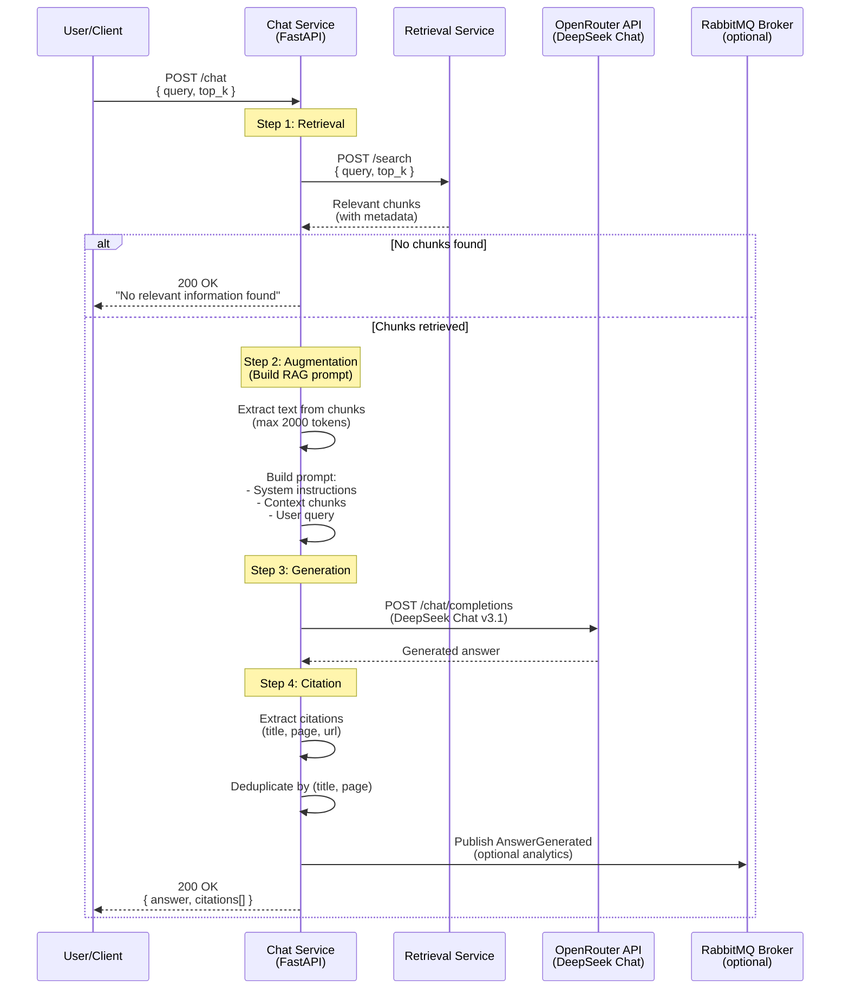

# Chat Service Pipeline (RAG)

Overview of the Retrieval-Augmented Generation process.



## Chat Request

```json
{
  "query": "What is the exam policy?",
  "top_k": 5
}
```

## Chat Response

```json
{
  "query": "What is the exam policy?",
  "answer": "According to the MARP Academic Regulations 2024 (page 15), students must complete 120 credits across three years. The exam policy states that students are required to sit examinations in person unless granted special accommodations. Refer to the Examination Guidelines (page 8) for detailed requirements.",
  "citations": [
    {
      "title": "Academic Regulations 2024",
      "page": 15,
      "url": "https://www.lancaster.ac.uk/.../Academic-Regs.pdf"
    },
    {
      "title": "Examination Guidelines",
      "page": 8,
      "url": "https://www.lancaster.ac.uk/.../Exam-Guidelines.pdf"
    }
  ]
}
```

## Technologies

- **Framework**: FastAPI + Pydantic
- **HTTP Client**: httpx (for Retrieval Service)
- **LLM Provider**: OpenRouter API
- **LLM SDK**: OpenAI SDK (compatible with OpenRouter)
- **Model**: deepseek/deepseek-chat-v3.1:free
- **Message Broker**: RabbitMQ (optional, for analytics)
