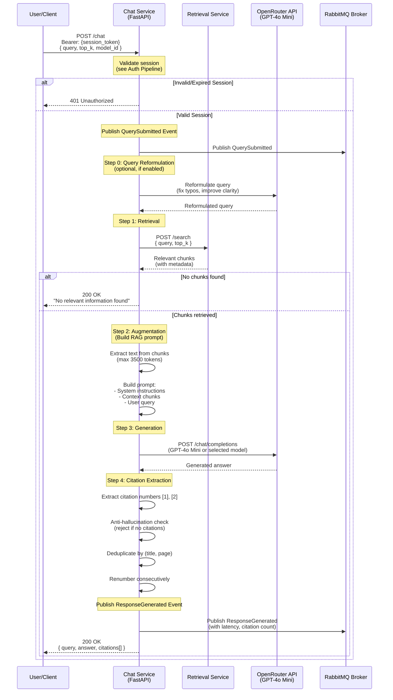

# Chat Service Pipeline (RAG)

Overview of the Retrieval-Augmented Generation process.

**Note:** For authentication flows, see [Auth Pipeline](../Auth/Auth_pipeline.md)



## Chat Request

```json
{
  "query": "What is the exam policy?",
  "top_k": 8,
  "session_id": "optional-session-id",
  "model_id": "openai/gpt-4o-mini"
}
```

**Headers:**
```
Authorization: Bearer <session_token>
```

## Chat Response

```json
{
  "query": "What is the exam policy?",
  "answer": "According to the MARP General Regulations [1], students must complete examinations as scheduled. If illness occurs during exams, contact your department immediately [2].",
  "citations": [
    {
      "title": "General Regulations",
      "page": 15,
      "url": "https://www.lancaster.ac.uk/.../General-Regs.pdf"
    },
    {
      "title": "Assessment Regulations",
      "page": 8,
      "url": "https://www.lancaster.ac.uk/.../Assessment-Regs.pdf"
    }
  ]
}
```

## RAG Pipeline Steps

### Step 0: Query Reformulation (Optional)
- **Purpose**: Fix typos and improve query clarity
- **Method**: Send query to LLM for reformulation
- **Configurable**: `ENABLE_QUERY_REFORMULATION` environment variable
- **Output**: Reformulated query or original if disabled

### Step 1: Retrieval
- **Service**: Retrieval Service via HTTP
- **Input**: Query (original or reformulated)
- **Method**: Semantic search using SentenceTransformer embeddings
- **Output**: Top-K document chunks with metadata
- **Default top_k**: 8 chunks

### Step 2: Augmentation
- **Process**: Build RAG prompt from retrieved chunks
- **Components**:
  - System instructions (answer based on context only)
  - Retrieved context (up to 3500 tokens)
  - User query
  - Citation requirements
- **Token Management**: Truncates long chunks to fit context window

### Step 3: Generation
- **Provider**: OpenRouter API
- **Primary Model**: `openai/gpt-4o-mini`
- **User-Selectable**: Can use saved model preference or request-specific model
- **Temperature**: 0.4 (balanced for focused answers)
- **Max Tokens**: 1200

### Step 4: Citation Extraction
1. **Extract citation numbers** from answer (e.g., [1], [2], [3])
2. **Anti-hallucination check**: Reject answers without citations
3. **Deduplicate**: Remove duplicate (title, page) pairs
4. **Renumber**: Ensure consecutive citation numbering [1], [2], [3]...
5. **Filter**: Keep only citations referenced in final answer

## Quality Features

### Anti-Hallucination
- Rejects LLM answers that contain no citations
- Returns fallback message if answer lacks sources
- Logs rejected answers for debugging

### Citation Deduplication
- Identifies duplicate citations by (title, page) tuple
- Maintains single citation per unique source
- Renumbers references to point to deduplicated citations

### Query Reformulation
- Optional preprocessing to fix typos
- Improves retrieval accuracy
- Logged for transparency (original → reformulated)

### Insufficient Information Detection
- Detects phrases indicating lack of information
- Removes citation markers from such answers
- Returns clean fallback message

## Analytics Events

### QuerySubmitted
- Published when query received
- Payload: query, user_id, session_id, model_id
- Routing key: `analytics.query.submitted`

### ResponseGenerated
- Published after successful response
- Payload: query, response, model_id, latency_ms, citation_count, retrieval_count, user_id
- Routing key: `analytics.response.generated`

## Authentication

- **Required**: All `/chat` endpoints require session token
- **Method**: Bearer token in Authorization header
- **Validation**: Direct Redis lookup of session data
- **Returns**: 401 if session invalid or expired

For detailed authentication flows, see [Auth Pipeline](../Auth/Auth_pipeline.md)

## Configuration

### Environment Variables
```
OPENROUTER_API_KEY - OpenRouter API key
PRIMARY_MODEL_ID - Default model (openai/gpt-4o-mini)
RETRIEVAL_URL - Retrieval Service endpoint (http://retrieval:8002)
REDIS_HOST/PORT - Session validation
RABBITMQ_HOST/PORT - Event publishing
ENABLE_QUERY_REFORMULATION - Enable query reformulation (default: true)
MAX_CONTEXT_TOKENS - Max context from chunks (default: 3500)
TEMPERATURE - LLM temperature (default: 0.4)
MAX_TOKENS - Max response tokens (default: 1200)
```

## Technologies

- **Framework**: FastAPI + Pydantic
- **HTTP Client**: RetrievalClient (httpx-based)
- **LLM Provider**: OpenRouter API
- **LLM SDK**: OpenAI SDK (compatible with OpenRouter)
- **Primary Model**: openai/gpt-4o-mini
- **Session Store**: Redis (direct access)
- **Message Broker**: RabbitMQ (event publishing)
- **Event System**: common/events.py (event creation)
