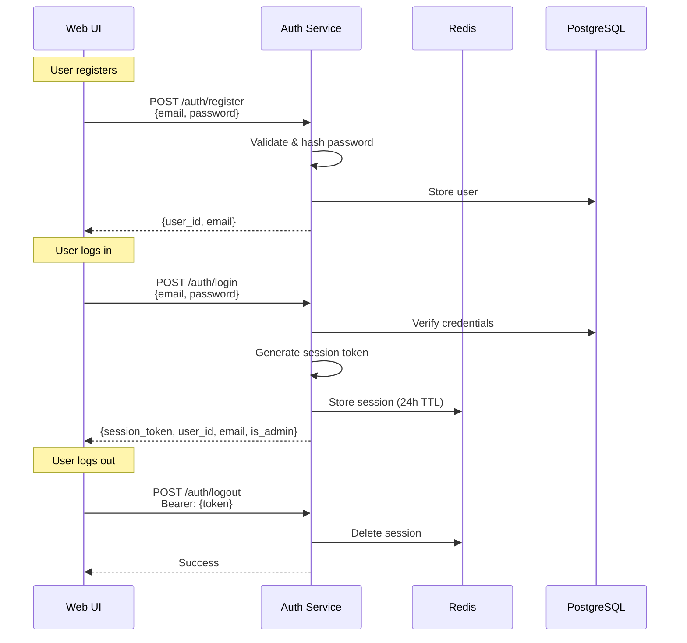
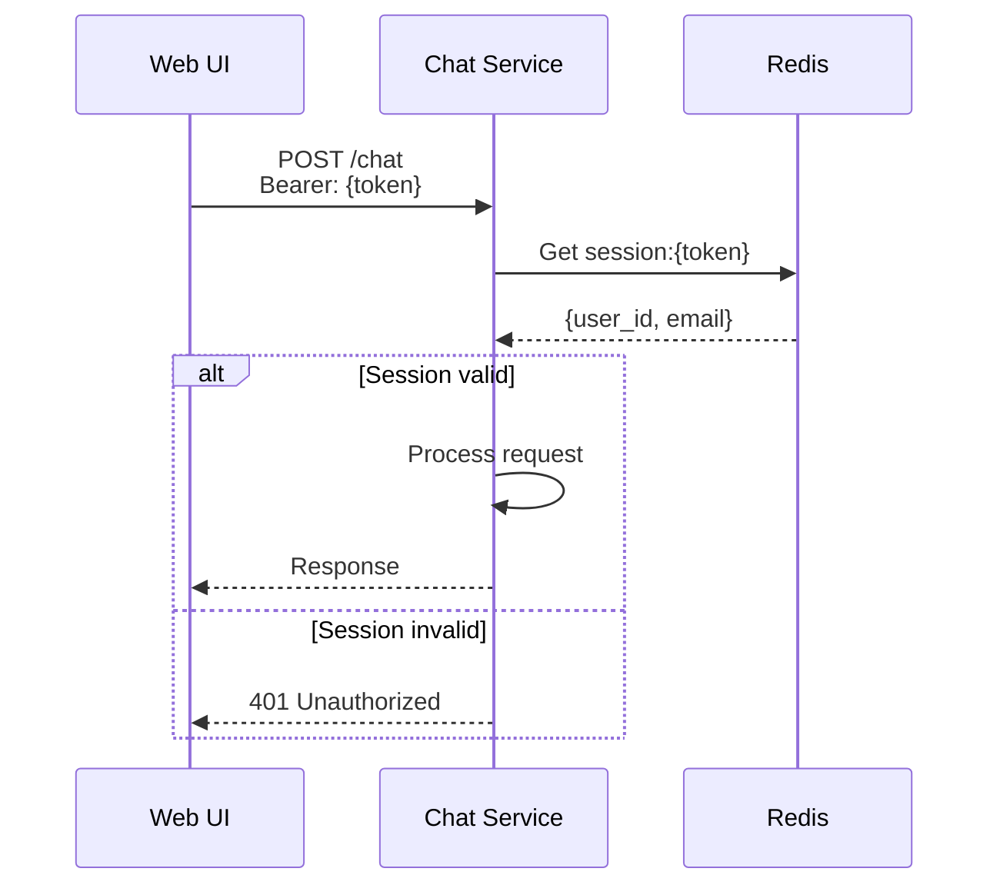

# Tier 1: User Authentication & Session Management

**Status**: **Implemented (Assessment 2 - Sprint 2)**

## Implementation Summary

**Implemented Features:**
- User registration (email + password)
- Login/Logout with session management
- Session tokens stored in Redis (24h TTL)
- Password hashing with bcrypt
- Session validation for Chat Service
- User model preference storage (PostgreSQL)
- Admin user support
- PostgreSQL for persistent user data

**Service Documentation:**
- See [Auth Service](Auth/auth-service.md) for complete API specification

---

## Overview

Tier 1 implements user authentication and session management to enable multi-user access to the MARP-Guide AI system. Each user has their own account with isolated sessions.

## Key Features

### 1. User Registration & Login

**Registration:**
- Open registration with email and password
- Email format validation via Pydantic
- Password minimum 8 characters
- Passwords hashed with bcrypt before storage
- User accounts stored in PostgreSQL

**Login:**
- Credential verification against PostgreSQL
- Session token generation (cryptographically secure random)
- Session stored in Redis with 24-hour TTL
- Returns session token for subsequent requests

### 2. Session Management

**Session Storage:**
- Redis key pattern: `session:{token}`
- Session data: `{user_id, email, is_admin}`
- Automatic expiration after 24 hours
- Sessions deleted on logout

**Session Validation:**
- All Chat Service endpoints require valid session token
- Token passed via `Authorization: Bearer <token>` header
- Chat Service validates sessions directly via Redis
- Returns 401 if session invalid or expired

### 3. User Preferences

**Model Preference:**
- Users can save their preferred LLM model
- Stored in PostgreSQL `user_preferences` table
- Persists across sessions
- Accessible via `/auth/preferences/model` endpoints

### 4. Admin Users

**Admin Capabilities:**
- Default admin account: `admin@example.com` / `admin`
- Created automatically on service startup
- Admin users can view global analytics
- Non-admin users see only their own data

## Architecture

### Services Involved

**Auth Service (Port 8004):**
- User registration and login
- Session token generation
- Session validation
- User preference storage

**PostgreSQL:**
- `users` table - user accounts
- `user_preferences` table - model preferences
- Persistent storage for user data

**Redis:**
- Session token storage
- 24-hour TTL for automatic cleanup

### Authentication Flow



### Session Validation Flow



## Database Schema

### PostgreSQL Tables

```sql
-- Users table
CREATE TABLE users (
    user_id UUID PRIMARY KEY DEFAULT gen_random_uuid(),
    email VARCHAR(255) UNIQUE NOT NULL,
    password_hash VARCHAR(255) NOT NULL,
    is_admin BOOLEAN DEFAULT FALSE,
    created_at TIMESTAMP DEFAULT CURRENT_TIMESTAMP
);

-- User preferences table
CREATE TABLE user_preferences (
    user_id UUID PRIMARY KEY REFERENCES users(user_id) ON DELETE CASCADE,
    selected_model VARCHAR(255),
    updated_at TIMESTAMP DEFAULT CURRENT_TIMESTAMP
);
```

### Redis Structure

```
-- Session storage
Key: session:{token}
Value: {"user_id": "...", "email": "...", "is_admin": false}
TTL: 24 hours (86400 seconds)
```

## API Endpoints

### Auth Service

```
POST   /auth/register          - Register new user account
POST   /auth/login             - Authenticate user and create session
POST   /auth/logout            - Invalidate session token
GET    /auth/validate          - Validate session (internal use)
POST   /auth/preferences/model - Save user's preferred LLM model
GET    /auth/preferences/model - Retrieve user's preferred model
GET    /health                 - Health check endpoint
```

See [Auth Service documentation](Auth/auth-service.md) for detailed API specifications.

## Security Features

### Password Security
- All passwords hashed with bcrypt before storage
- Plaintext passwords never stored or logged
- Minimum password length enforced (8 characters)

### Session Security
- Tokens generated using `secrets.token_urlsafe(32)` (cryptographically secure)
- Tokens transmitted via HTTPS only in production
- Automatic expiration after 24 hours
- Logout deletes token immediately

### API Security
- All Chat Service endpoints require session token
- Session validation enforced at service boundary
- User isolation at Redis key level
- Input validation for email format

## Implementation Details

### Technologies Used
- **FastAPI** - REST API framework
- **bcrypt** - Password hashing
- **PostgreSQL** - Persistent user storage
- **Redis** - Session storage
- **Pydantic** - Request/response validation

### Configuration

**Auth Service Environment Variables:**
```
POSTGRES_HOST=postgres
POSTGRES_PORT=5432
POSTGRES_USER=marp_user
POSTGRES_PASSWORD=marp_password
POSTGRES_DB=marp_db

REDIS_HOST=redis
REDIS_PORT=6379
```
