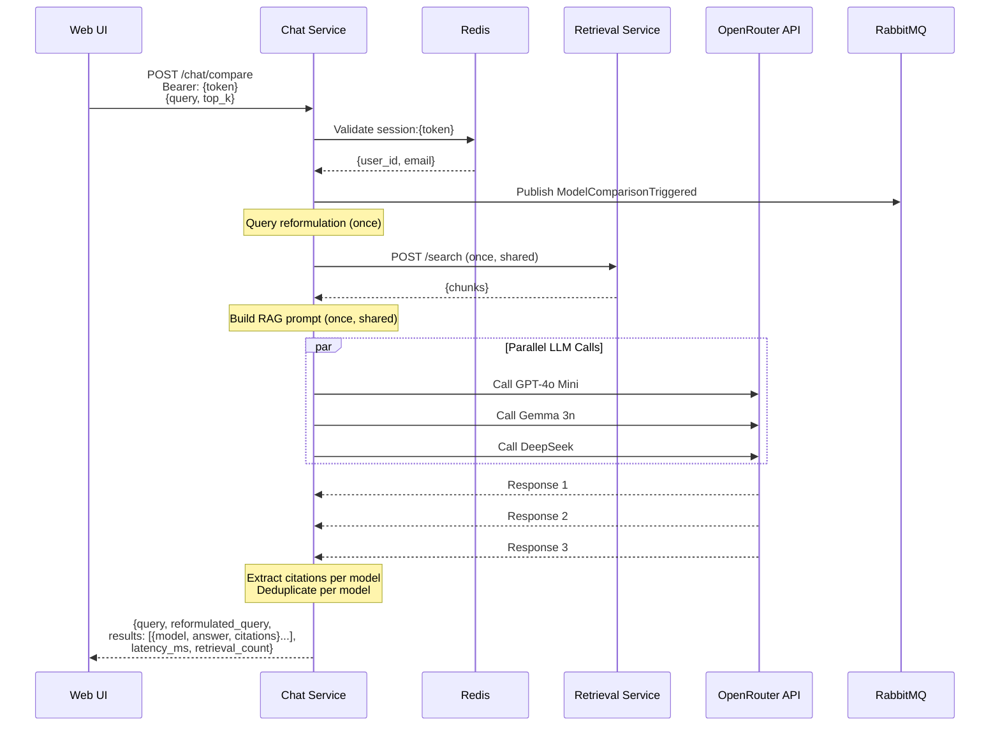
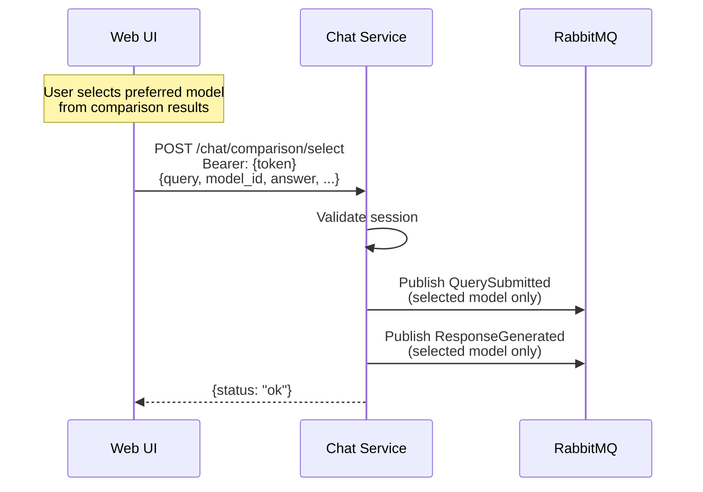

# Tier 2: Multi-Model Comparison

**Status**: **Implemented (Assessment 2 - Sprint 2)**

## Implementation Summary

**Implemented Features:**
- Parallel answer generation with 3 LLM models
- Models: GPT-4o Mini, Google Gemma 3n (2B), DeepSeek Chat
- Shared retrieval context across all models
- Side-by-side comparison UI support
- Per-model citations with deduplication
- Query reformulation before retrieval
- Analytics event tracking (ModelComparisonTriggered)
- Parallel execution using ThreadPoolExecutor
- Model selection analytics recording

**Service Documentation:**
- See [Multi-Model Service](MultiModel/multimodel-service.md) for complete API specification

---

## Overview

Tier 2 implements multi-model comparison, allowing users to compare answers from 3 different LLM models side-by-side. All models receive the same query and retrieval context, enabling direct comparison of their responses.

## Key Features

### 1. Parallel Model Execution

**Three Fixed Models:**
1. **GPT-4o Mini** - `openai/gpt-4o-mini`
   - Fast and efficient for general questions
2. **Google Gemma 3n 2B** - `google/gemma-3n-e2b-it:free`
   - Lightweight and fast Google model
3. **DeepSeek Chat** - `deepseek/deepseek-chat`
   - Dialogue-optimized for conversational QA

**Parallel Processing:**
- All 3 models execute simultaneously via ThreadPoolExecutor
- Single retrieval call shared across all models
- Total latency = max(model latencies) + retrieval time
- Failed models don't block successful ones

### 2. Shared Context

**Query Processing:**
- Single query reformulation (if enabled) used for all models
- One retrieval call to get document chunks
- Same RAG prompt template for all models
- Identical context ensures fair comparison

**Citation Handling:**
- Each model generates independent citations
- Per-model deduplication of citations
- Citation numbers renumbered consecutively per model
- Anti-hallucination check per model (rejects answers without citations)

### 3. Comparison Endpoints

**`/chat/compare`:**
- Generates answers from all 3 models in parallel
- Returns array of results with model_id, model_name, answer, citations
- Includes query, reformulated_query, total latency, retrieval count

**`/chat/comparison/select`:**
- Records analytics when user selects a model
- Publishes QuerySubmitted and ResponseGenerated events for selected model only
- Enables tracking of user preferences across comparisons

## Architecture

### Multi-Model Comparison Flow



### Model Selection Flow



## Implementation Details

### Parallel Execution

```python
# ThreadPoolExecutor with 3 workers
with ThreadPoolExecutor(max_workers=3) as executor:
    future_to_model = {
        executor.submit(generate_with_model, model): model
        for model in COMPARISON_MODELS
    }

    for future in as_completed(future_to_model):
        result = future.result()
        results.append(result)
```

**Benefits:**
- Reduced total latency (parallel vs sequential)
- Independent failure handling per model
- Results returned as models complete

### Citation Processing Per Model

Each model independently:
1. Extracts citation numbers from answer `[1], [2], [3]`
2. Validates against retrieved chunks
3. Deduplicates by (title, page) tuple
4. Renumbers citations consecutively
5. Returns final answer with clean citations

**Anti-hallucination:**
- Rejects answers without any citations
- Replaces hallucinated answers with fallback message
- Logs warnings for debugging

### Query Reformulation

**Shared Reformulation:**
- Reformulates query once before retrieval
- Same reformulated query used for all 3 models
- Ensures fair comparison (all models see same input)
- Configurable via `ENABLE_QUERY_REFORMULATION`

## API Endpoints

### Multi-Model Service

```
POST /chat/compare            - Generate parallel answers from 3 models (auth required)
POST /chat/comparison/select  - Record model selection analytics (auth required)
```

See [Multi-Model Service documentation](MultiModel/multimodel-service.md) for detailed API specifications.

## Analytics Integration

### Events Published

**ModelComparisonTriggered:**
- Published when `/chat/compare` is called
- Payload includes: query, user_session_id, models array, user_id
- Routing key: `analytics.model.comparison.triggered`

**QuerySubmitted + ResponseGenerated:**
- Published when user selects a model via `/chat/comparison/select`
- Only for the selected model (not all 3)
- Enables tracking of model preferences

### Analytics Consumption

Analytics Service consumes comparison events to track:
- Total comparisons performed
- Popular queries in comparison mode
- Model performance metrics
- User selection patterns

## Configuration

### Model Configuration

Models defined in `config.py`:
```python
COMPARISON_MODELS = [
    {
        "id": "openai/gpt-4o-mini",
        "name": "GPT-4o Mini",
        "description": "Fast and efficient for general questions"
    },
    {
        "id": "google/gemma-3n-e2b-it:free",
        "name": "Google Gemma 3n 2B",
        "description": "Lightweight and fast Google model"
    },
    {
        "id": "deepseek/deepseek-chat",
        "name": "DeepSeek Chat",
        "description": "Dialogue-optimized for conversational QA"
    }
]
```

### Environment Variables

```
OPENROUTER_API_KEY - OpenRouter API key for LLM access
RETRIEVAL_URL - Retrieval Service endpoint
REDIS_HOST/PORT - Session validation
RABBITMQ_HOST/PORT - Event publishing
ENABLE_QUERY_REFORMULATION - Enable/disable query reformulation (default: true)
```

## Performance Characteristics

### Latency

**Parallel Execution:**
- Total time ≈ max(model1_time, model2_time, model3_time) + retrieval_time
- Typical: 3-5 seconds total
- Much faster than sequential (which would be sum of all times)

**Breakdown:**
- Query reformulation: ~500-1000ms (if enabled, shared)
- Retrieval: ~500-1000ms (shared across models)
- Model execution: ~2000-4000ms (parallel, max of 3)
- Citation processing: ~100-200ms per model (parallel)

### Error Handling

**Individual Model Failures:**
- Failed models return error message in their result slot
- Successful models still return results
- No blocking across models
- User sees partial results if some models succeed

**Complete Failure:**
- Returns empty results for all models
- Error logged for debugging
- User sees appropriate error message

## Technologies Used

- **ThreadPoolExecutor** - Parallel model execution
- **OpenRouter API** - Multi-model LLM access
- **FastAPI** - REST API framework
- **Redis** - Session validation
- **RabbitMQ** - Event publishing
- **Pydantic** - Request/response validation

## Use Cases

### 1. Model Quality Comparison
Users can compare answer quality across different models for the same query, helping them understand which model best suits their needs.

### 2. Citation Verification
By seeing multiple models' answers and citations, users can verify consistency and accuracy of information.

### 3. Model Selection
After comparing results, users can select their preferred model, which is recorded for analytics and future improvement.
