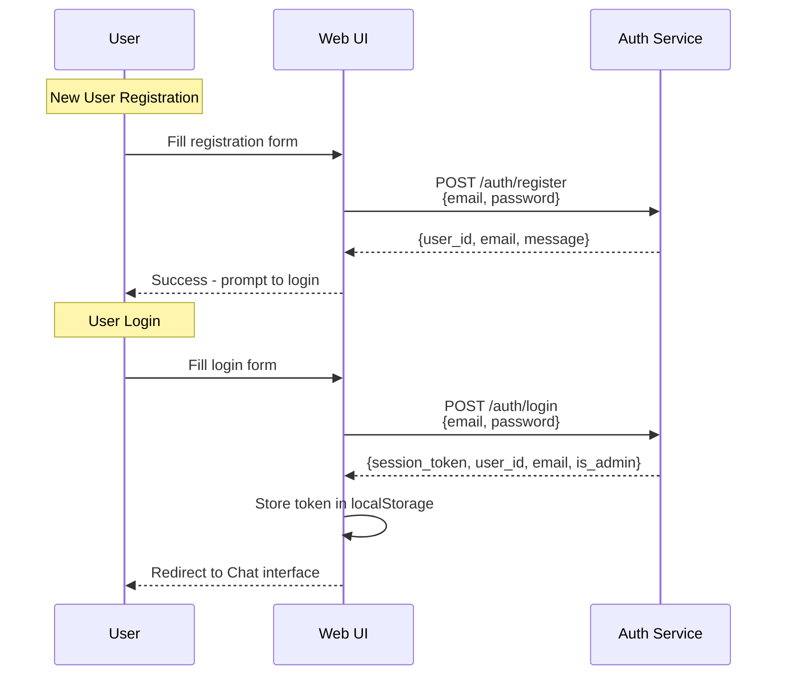
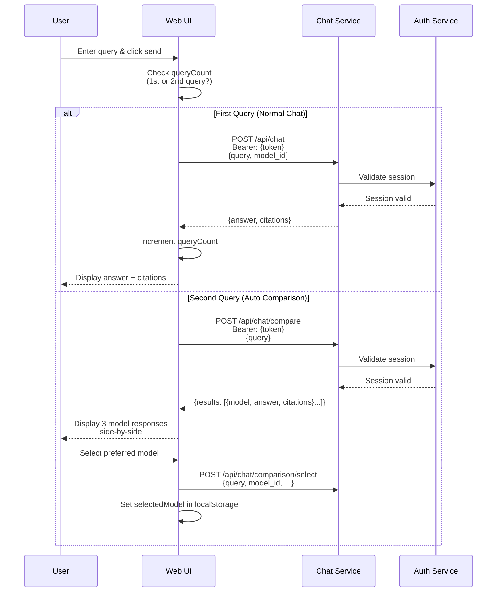
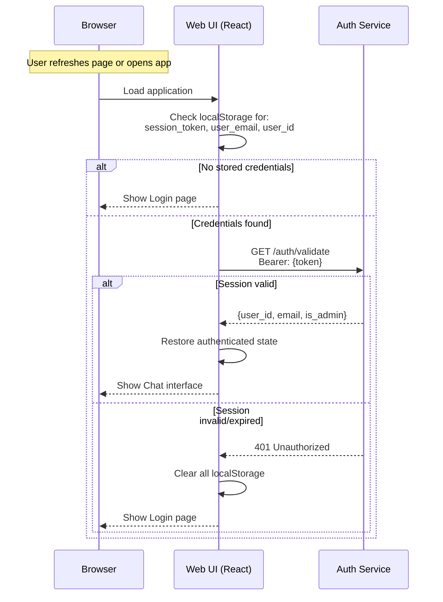

# Service Name: Web UI (Frontend)

## Responsibility

Provides the user interface for the MARP-Guide AI system. Implements user registration, login, RAG-powered chat with citations, automatic multi-model comparison, and analytics dashboard with Lancaster University branding.

## Data Owned

This service manages client-side state in browser localStorage:

- **Authentication State:**
  - `session_token` - Current user session token (24h validity)
  - `user_email` - Logged-in user's email address
  - `user_id` - Logged-in user's unique identifier

- **Chat State:**
  - `chatMessages` - Chat history for current session
  - `queryCount` - Number of queries submitted (triggers comparison on 2nd query)
  - `comparisonShown` - Flag to track if comparison has been shown
  - `selectedModel` - User's preferred LLM model ID

## Technology Stack

- **Framework**: React 18.2.0
- **Build Tool**: Vite 5.0.0 (Fast ES module-based build)
- **Styling**: Tailwind CSS 3.3.6 + Custom CSS Variables
- **HTTP Client**: Axios 1.6.0
- **Markdown Rendering**: react-markdown 9.0.0 (for formatted answers)
- **Production Server**: Nginx (Alpine-based Docker image)
- **Port**: 8080 (mapped from container port 80)

## Key Features

### 1. User Authentication
- **Registration Page**: Email + password registration with validation
- **Login Page**: Session-based authentication (24h token expiry)
- **Session Persistence**: Validates stored tokens on app load
- **Logout**: Clears all localStorage data for user isolation

### 2. RAG-Powered Chat Interface
- **Query Input**: Text input with send button
- **Message History**: Persistent chat history per session
- **Citations**: Clickable document citations with title, page, and URL
- **Markdown Support**: AI answers rendered with markdown formatting
- **Model Selection**: Dropdown to choose preferred LLM model

### 3. Multi-Model Comparison (Auto-triggered on 2nd Query)
- **Parallel Generation**: Shows answers from 3 models side-by-side
  - GPT-4o Mini
  - Google Gemma 3n 2B
  - DeepSeek Chat
- **Model Selection**: User picks preferred model (recorded for analytics)
- **Citation Comparison**: Each model's citations displayed independently

### 4. Analytics Dashboard
- **Admin View**: Global statistics across all users
- **User View**: Personal query history and statistics
- **Metrics Displayed**:
  - Total queries
  - Average latency
  - Popular queries
  - Model performance statistics

### 5. Lancaster University Branding
- **Logo**: Lancaster University logo in sidebar
- **Color Scheme**: Lancaster red (#C80F2E) and black
- **Professional UI**: Modern, accessible design

## User Interface Components

### Main Components

**App.jsx** (Root Component)
- Manages authentication state
- Routes between Login/Register and Main App
- Handles session validation on mount
- Provides logout and reset functionality

**Sidebar.jsx**
- Navigation between Chat and Analytics pages
- User info display (email)
- Action buttons (Logout, Reset)
- Lancaster University logo

**Login.jsx / Register.jsx**
- Authentication forms with validation
- Error message display
- Switch between login and registration

**ChatContainer.jsx**
- Main chat interface wrapper
- Integrates ChatInput, MessageList, and ModelSelector
- Manages query submission and comparison logic

**MessageList.jsx**
- Displays chat message history
- Renders user queries and AI responses
- Shows citations and markdown content

**ModelComparison.jsx**
- Side-by-side model comparison UI
- Displays 3 model responses with citations
- Model selection buttons

**Analytics.jsx**
- Analytics dashboard for admin/user metrics
- Charts and statistics display
- Popular queries and model performance

## API Integration

### Authentication API (`/api/auth`)

**Endpoints Used:**
- `POST /auth/register` - Register new user
- `POST /auth/login` - Login and get session token
- `POST /auth/logout` - Invalidate session
- `GET /auth/validate` - Validate existing session token

**Headers:**
```
Authorization: Bearer <session_token>
```

### Chat API (`/api/chat`)

**Endpoints Used:**
- `POST /api/chat` - Send single query to selected model
- `POST /api/chat/compare` - Get parallel responses from 3 models
- `POST /api/chat/comparison/select` - Record user's model selection

**Headers:**
```
Authorization: Bearer <session_token>
```

**Request Example (Single Query):**
```json
{
  "query": "What happens if I am ill during exams?",
  "model_id": "openai/gpt-4o-mini"
}
```

**Request Example (Comparison):**
```json
{
  "query": "What is the grade appeal process?"
}
```

### Analytics API (`/api/analytics`)

**Endpoints Used:**
- `POST /api/analytics/reset` - Clear all analytics data (admin only)

## Docker Configuration

### Build Process (Multi-Stage Dockerfile)

**Stage 1: Build React App**
```dockerfile
FROM node:20-alpine AS build
WORKDIR /app
COPY services/ui/package*.json ./
RUN npm ci
COPY services/ui/ .
RUN npm run build
```

**Stage 2: Serve with Nginx**
```dockerfile
FROM nginx:alpine
COPY --from=build /app/dist /usr/share/nginx/html
COPY services/ui/nginx.conf /etc/nginx/conf.d/default.conf
EXPOSE 80
```

### Nginx Configuration

- Serves static React build files
- Proxies API requests to backend services:
  - `/api/auth/*` → Auth Service (port 8004)
  - `/api/chat/*` → Chat Service (port 8003)
  - `/api/analytics/*` → Analytics Service (port 8005)

### Docker Compose Configuration

```yaml
ui:
  build:
    context: .
    dockerfile: services/ui/Dockerfile
  container_name: marp-ui
  depends_on:
    - chat
    - auth
  ports:
    - "8080:80"
  networks:
    - marp-network
  restart: unless-stopped
```

## User Flows

### Registration and Login Flow



### Chat Query Flow



### Session Validation on App Load



## State Management

### LocalStorage Schema

```javascript
{
  // Authentication
  "session_token": "xY9Kp2mN5vT8wQ3rL6zA1bC4eD7fG0hJ",
  "user_email": "student@example.com",
  "user_id": "550e8400-e29b-41d4-a716-446655440000",

  // Chat State
  "chatMessages": [
    {
      "type": "user",
      "text": "What is the exam policy?"
    },
    {
      "type": "assistant",
      "text": "According to MARP...",
      "citations": [...]
    }
  ],
  "queryCount": 1,
  "comparisonShown": false,
  "selectedModel": "openai/gpt-4o-mini"
}
```

### State Clearing on Logout

When user logs out, all localStorage is cleared to ensure user isolation:
- Authentication data (token, email, user_id)
- Chat history (messages, queryCount)
- User preferences (selectedModel, comparisonShown)

This prevents the next user from seeing previous user's data.

## Environment Variables

```bash
# API Endpoints (optional, defaults to nginx proxy paths)
VITE_AUTH_API_URL=/api/auth
VITE_CHAT_API_URL=/api/chat
VITE_ANALYTICS_API_URL=/api/analytics
```

## Error Handling

### Network Errors
- Connection timeouts (30s for auth/chat, 60s for comparison)
- Network disconnection
- Service unavailable

### Authentication Errors
- Invalid credentials (401)
- Session expired (401)
- Duplicate email on registration (400)

### Chat Errors
- Empty query validation
- Request timeout
- Service error (500) with helpful message

### Error Display
- User-friendly error messages shown in UI
- Console logging for debugging
- Automatic localStorage cleanup on auth failures

## Performance Characteristics

### Page Load
- Vite-optimized bundle with code splitting
- Lazy-loaded components
- Fast initial render with React 18

### API Request Timeouts
- Authentication operations: 30 seconds
- Normal chat queries: 30 seconds
- Comparison queries: 60 seconds (3 parallel models)
- Analytics recording: 5 seconds (non-blocking)

### Browser Compatibility
- Modern browsers (Chrome, Firefox, Safari, Edge)
- ES6+ JavaScript support required
- LocalStorage API required

## Security Features

### Client-Side Security
- Session tokens stored in localStorage (transmitted via HTTPS in production)
- Automatic token validation on app load
- Token cleared on logout or validation failure
- No sensitive data logged to console

### CSRF Protection
- Bearer token authentication (not cookie-based)
- CORS configured on backend services

### User Isolation
- Each user's chat history isolated in their browser
- localStorage cleared on logout
- Server-side session validation for all authenticated requests

## Accessibility

- Semantic HTML structure
- Keyboard navigation support
- Focus management for modals/forms
- ARIA labels for screen readers (where implemented)
- High contrast Lancaster branding colors

## Development

### Local Development
```bash
cd services/ui
npm install
npm run dev  # Starts Vite dev server on port 5173
```

### Production Build
```bash
npm run build  # Builds to services/ui/dist/
```

### Docker Build
```bash
docker-compose build ui
docker-compose up ui
```

## Future Enhancements (Documented for Reference)

- Real-time typing indicators
- Chat history persistence across sessions (backend storage)
- Advanced analytics visualizations
- Mobile-responsive design improvements
- Accessibility audit and WCAG compliance
- Progressive Web App (PWA) support
